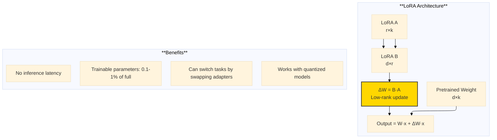

# LoRA (Low-Rank Adaptation) is a parameter-efficien

```mermaid
---
config:
  theme: base
  layout: elk
---
graph TD
    subgraph "**LoRA Architecture**"
        W[Pretrained Weight<br/>d×k] --> O[Output = W·x + ΔW·x]
        
        A[LoRA A<br/>r×k] --> B[LoRA B<br/>d×r]
        A --> B
        B --> ΔW[ΔW = B·A<br/>Low-rank update]
        
        ΔW --> O
    end
    
    subgraph "**Benefits**"
        B1[Trainable parameters: 0.1-1% of full]
        B2[Can switch tasks by swapping adapters]
        B3[No inference latency]
        B4[Works with quantized models]
    end
    
    style ΔW fill:#ffd700,stroke:#333,stroke-width:2px
```
