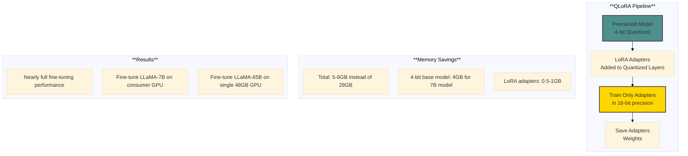

# QLoRA combines LoRA with 4-bit quantization to fin

```mermaid
---
config:
  theme: base
  layout: elk
---
graph TD
    subgraph "**QLoRA Pipeline**"
        M[Pretrained Model<br/>4-bit Quantized] --> L[LoRA Adapters<br/>Added to Quantized Layers]
        L --> T[Train Only Adapters<br/>in 16-bit precision]
        T --> S[Save Adapters<br/>Weights]
    end
    
    subgraph "**Memory Savings**"
        B1[4-bit base model: 4GB for 7B model]
        B2[LoRA adapters: 0.5-1GB]
        B3[Total: 5-6GB instead of 28GB]
    end
    
    subgraph "**Results**"
        R1[Fine-tune LLaMA-7B on consumer GPU]
        R2[Fine-tune LLaMA-65B on single 48GB GPU]
        R3[Nearly full fine-tuning performance]
    end
    
    style M fill:#4d908e,stroke:#333,stroke-width:2px
    style T fill:#ffd700,stroke:#333,stroke-width:2px
```
