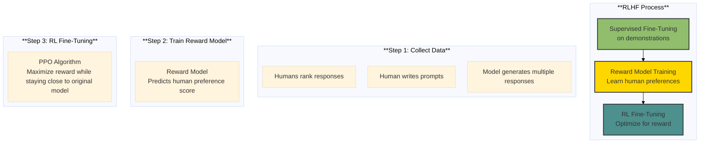

# RLHF (Reinforcement Learning from Human Feedback) 

```mermaid
---
config:
  theme: base
  layout: elk
---
graph TD
    subgraph "**RLHF Process**"
        S[Supervised Fine-Tuning<br/>on demonstrations] --> R[Reward Model Training<br/>Learn human preferences]
        R --> P[RL Fine-Tuning<br/>Optimize for reward]
    end
    
    subgraph "**Step 1: Collect Data**"
        D1[Human writes prompts]
        D2[Model generates multiple responses]
        D3[Humans rank responses]
    end
    
    subgraph "**Step 2: Train Reward Model**"
        RM[Reward Model<br/>Predicts human preference score]
    end
    
    subgraph "**Step 3: RL Fine-Tuning**"
        RL[PPO Algorithm<br/>Maximize reward while staying close to original model]
    end
    
    style S fill:#90be6d,stroke:#333,stroke-width:2px
    style R fill:#ffd700,stroke:#333,stroke-width:2px
    style P fill:#4d908e,stroke:#333,stroke-width:2px
```
