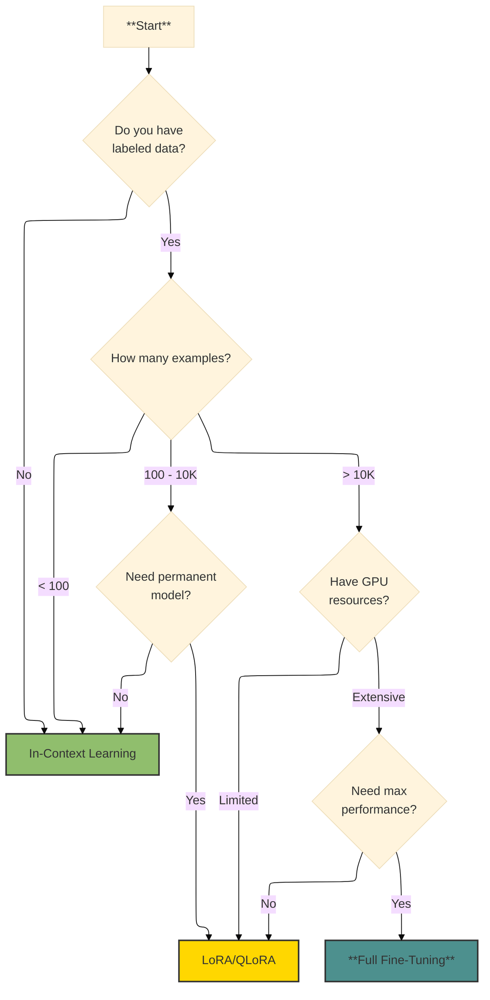

# ## 🎯 Decision Framework: Which Approach to Use?

```mermaid
---
config:
  theme: base
  layout: elk
---
graph TD
    A[**Start**] --> B{Do you have<br/>labeled data?}
    
    B -->|No| C[In-Context Learning]
    B -->|Yes| D{How many examples?}
    
    D -->|< 100| C
    D -->|100 - 10K| E{Need permanent<br/>model?}
    D -->|> 10K| F{Have GPU<br/>resources?}
    
    E -->|No| C
    E -->|Yes| G[LoRA/QLoRA]
    
    F -->|Limited| G
    F -->|Extensive| H{Need max<br/>performance?}
    
    H -->|No| G
    H -->|Yes| I[**Full Fine-Tuning**]
    
    style C fill:#90be6d,stroke:#333,stroke-width:2px
    style G fill:#ffd700,stroke:#333,stroke-width:2px
    style I fill:#4d908e,stroke:#333,stroke-width:2px
```
