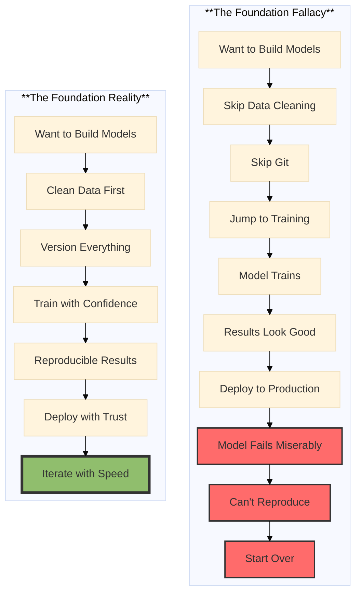

# This is the foundation fallacy.

```mermaid
---
config:
  theme: base
  layout: elk
---
graph TD
    subgraph "**The Foundation Fallacy**"
        A[Want to Build Models] --> B[Skip Data Cleaning]
        B --> C[Skip Git]
        C --> D[Jump to Training]
        D --> E[Model Trains]
        E --> F[Results Look Good]
        F --> G[Deploy to Production]
        G --> H[Model Fails Miserably]
        H --> I[Can't Reproduce]
        I --> J[Start Over]
    end
    
    subgraph "**The Foundation Reality**"
        K[Want to Build Models] --> L[Clean Data First]
        L --> M[Version Everything]
        M --> N[Train with Confidence]
        N --> O[Reproducible Results]
        O --> P[Deploy with Trust]
        P --> Q[Iterate with Speed]
    end
    
    style H fill:#ff6b6b,stroke:#333,stroke-width:2px
    style I fill:#ff6b6b,stroke:#333,stroke-width:2px
    style J fill:#ff6b6b,stroke:#333,stroke-width:2px
    style Q fill:#90be6d,stroke:#333,stroke-width:4px
```
