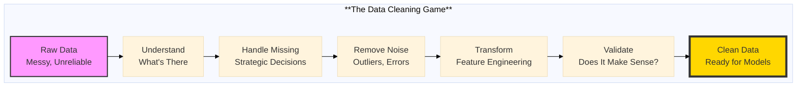

# Data cleaning is the same.

```mermaid
---
config:
  theme: base
  layout: elk
---
graph LR
    subgraph "**The Data Cleaning Game**"
        A[Raw Data<br/>Messy, Unreliable] --> B[Understand<br/>What's There]
        B --> C[Handle Missing<br/>Strategic Decisions]
        C --> D[Remove Noise<br/>Outliers, Errors]
        D --> E[Transform<br/>Feature Engineering]
        E --> F[Validate<br/>Does It Make Sense?]
        F --> G[Clean Data<br/>Ready for Models]
    end
    
    style A fill:#f9f,stroke:#333,stroke-width:2px
    style G fill:#ffd700,stroke:#333,stroke-width:4px
```
