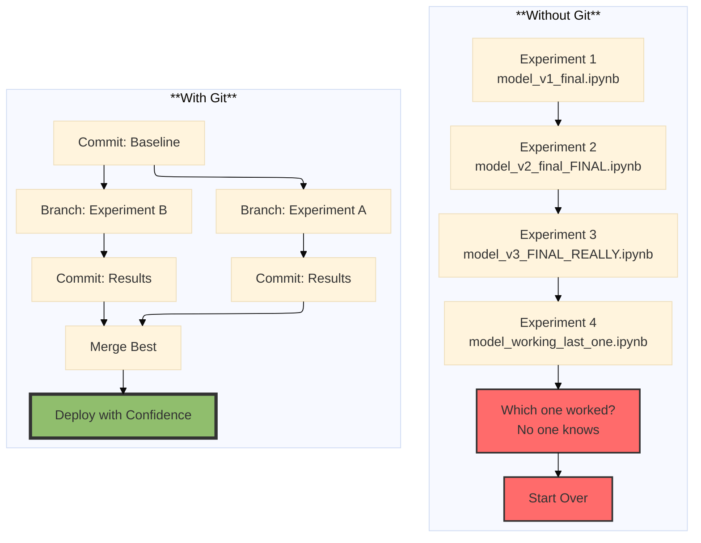

# Git is often treated as a developer tool that "AI 

```mermaid
---
config:
  theme: base
  layout: elk
---
graph TD
    subgraph "**Without Git**"
        A[Experiment 1<br/>model_v1_final.ipynb] --> B[Experiment 2<br/>model_v2_final_FINAL.ipynb]
        B --> C[Experiment 3<br/>model_v3_FINAL_REALLY.ipynb]
        C --> D[Experiment 4<br/>model_working_last_one.ipynb]
        D --> E[Which one worked?<br/>No one knows]
        E --> F[Start Over]
    end
    
    subgraph "**With Git**"
        G[Commit: Baseline] --> H[Branch: Experiment A]
        G --> I[Branch: Experiment B]
        H --> J[Commit: Results]
        I --> K[Commit: Results]
        J --> L[Merge Best]
        K --> L
        L --> M[Deploy with Confidence]
    end
    
    style E fill:#ff6b6b,stroke:#333,stroke-width:2px
    style F fill:#ff6b6b,stroke:#333,stroke-width:2px
    style M fill:#90be6d,stroke:#333,stroke-width:4px
```
