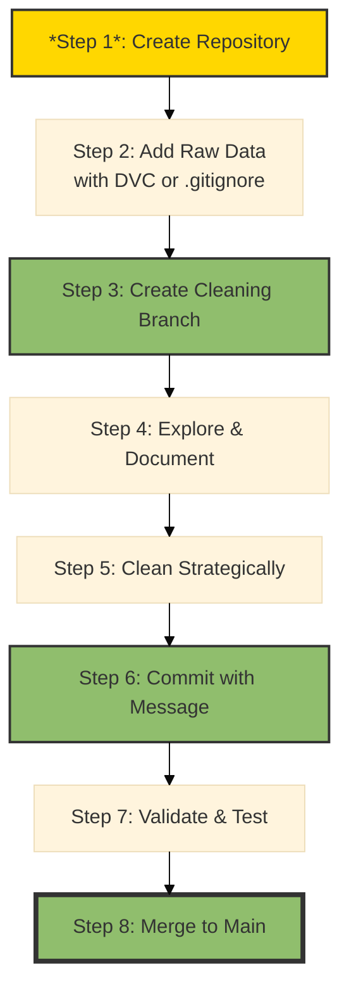

# Here's a practical workflow that combines data cle

```mermaid
---
config:
  theme: base
  layout: elk
---
graph TD
    A[*Step 1*: Create Repository] --> B[Step 2: Add Raw Data<br/>with DVC or .gitignore]
    B --> C[Step 3: Create Cleaning Branch]
    C --> D[Step 4: Explore & Document]
    D --> E[Step 5: Clean Strategically]
    E --> F[Step 6: Commit with Message]
    F --> G[Step 7: Validate & Test]
    G --> H[Step 8: Merge to Main]
    
    style A fill:#ffd700,stroke:#333,stroke-width:2px
    style C fill:#90be6d,stroke:#333,stroke-width:2px
    style F fill:#90be6d,stroke:#333,stroke-width:2px
    style H fill:#90be6d,stroke:#333,stroke-width:4px
```
