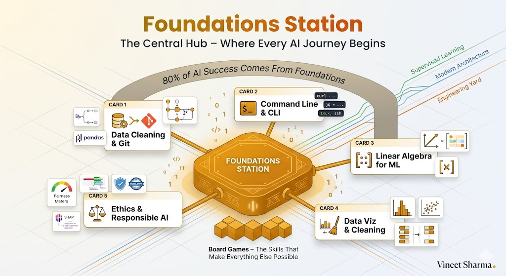
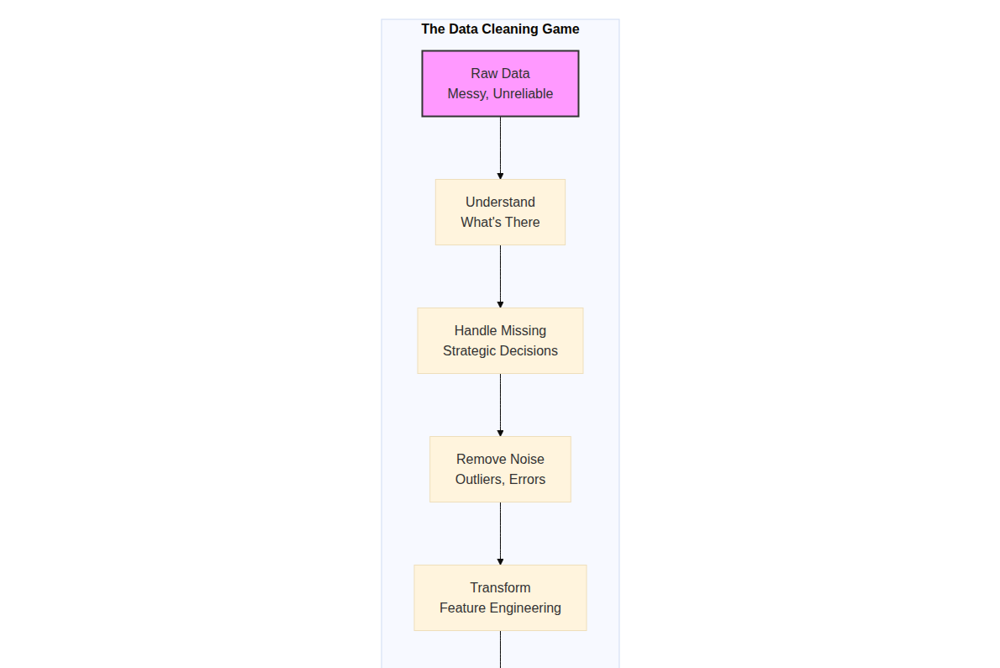
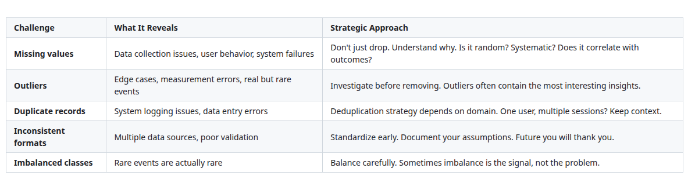
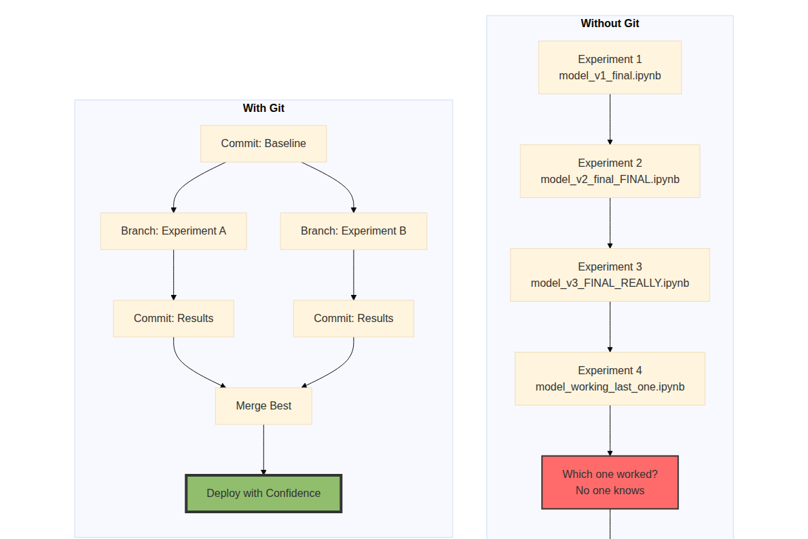
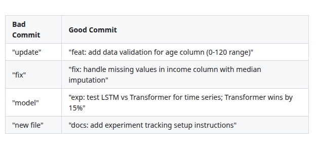
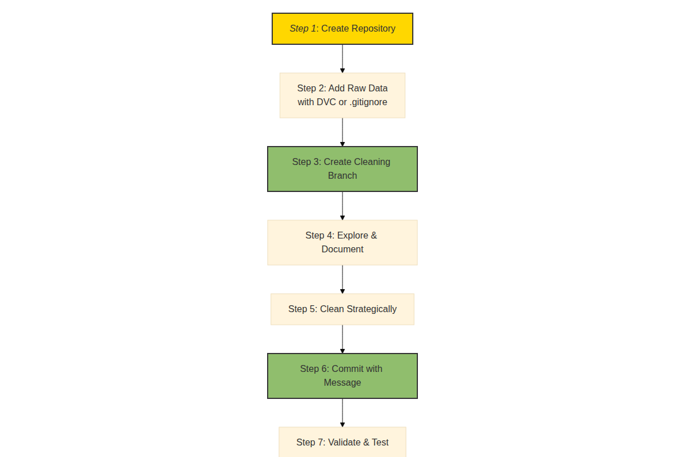

# The 2026 AI Metromap: Foundations Station – Why Data Cleaning and Git Are Your Board Games, Not Just Chores

## Series A: Foundations Station | Story 1 of 5




## 📖 Introduction

**Welcome to Foundations Station—the central hub of your AI journey.**

You've completed the Master Arc. You understand the map, you've chosen your express line, and you know how to avoid derailments. Now it's time to build the foundation that makes every other station accessible.

If you've been in AI for any amount of time, you've heard the advice: "Data cleaning is 80% of the work." "Use Git for version control." It sounds like a chore. It sounds like something to get through before the "real" work begins.

This mindset is why most AI projects fail.

Data cleaning and Git aren't chores you tolerate. They're **board games**—the strategic skills that separate those who ship from those who struggle. A brilliant model trained on dirty data is useless. A perfect notebook lost because you didn't commit it is worthless.

This story—**The 2026 AI Metromap: Foundations Station – Why Data Cleaning and Git Are Your Board Games, Not Just Chores**—is your introduction to the skills that make everything else possible. We'll reframe these "boring" fundamentals as strategic enablers. We'll show you why skipping them guarantees failure. And we'll give you a practical framework to master them efficiently.

**Let's build the foundation.**

---

## 📚 Where You Are in the Journey

### The Master Story Arc: The 2026 AI Metromap Series (Complete)

- 🗺️ **[The 2026 AI Metromap: Why the Old Learning Routes Are Obsolete](#)** – A paradigm shift from linear learning to transit-system mastery.
- 🧭 **[The 2026 AI Metromap: Reading the Map](#)** – Strategic navigation across the three core lines.
- 🎒 **[The 2026 AI Metromap: Avoiding Derailments](#)** – Diagnosing and preventing the most common learning pitfalls.
- 🏁 **[The 2026 AI Metromap: From Passenger to Driver](#)** – Building your portfolio using the Metromap structure.

### Series A: Foundations Station (5 Stories)

- 🏗️ **The 2026 AI Metromap: Foundations Station – Why Data Cleaning and Git Are Your Board Games, Not Just Chores** – Reframing foundational skills as strategic enablers; practical data cleaning; Git workflows for model versioning. **⬅️ YOU ARE HERE**

- 🖥️ **[The 2026 AI Metromap: Command Line & Version Control – Navigating the Terminal Like a Conductor](#)** – Essential CLI tools for AI development; Git branching strategies; SSH and remote GPU training setup. 🔜 *Up Next*

- 🧮 **[The 2026 AI Metromap: Linear Algebra for ML – The Language of the Map](#)** – Vectors, matrices, and tensors explained through intuition; dot products as attention mechanisms; eigenvalues and PCA.

- 📊 **[The 2026 AI Metromap: Data Cleaning & Visualization – Turning Raw Data into Tracks](#)** – Real-world data wrangling with pandas, polars, and DuckDB; handling missing values, outliers, and imbalanced datasets.

- 🔄 **[The 2026 AI Metromap: Ethics & Responsible AI – The Safety Systems of the Metro](#)** – Bias detection and mitigation; interpretability; privacy-preserving AI; regulatory compliance.

### The Complete Story Catalog

For a complete view of all upcoming stories across every series, visit the **[Complete 2026 AI Metromap Story Catalog](#)**.

---

## 🚂 The Foundation Fallacy: Why Smart People Skip Basics

You're smart. You've built things before. You understand code. Why waste time on "boring" data cleaning when you could be building models?

This is the foundation fallacy.

```mermaid
```

](images/diagram_01_this-is-the-foundation-fallacy.png)

[View Source](https://github.com/Vineet-Sharma-Medium-Stories/Medium-Assets/blob/main/the-2026-ai-metromap-foundations-station--why-data-cleaning-and-git-are-your-board-games-not-just-chores/diagram_01_this-is-the-foundation-fallacy.md)


**The Reality:**

- **80% of real-world AI work is data.** Not models. Not algorithms. Data. If you can't clean it, you can't build anything that lasts.

- **Models without version control are experiments you can't repeat.** That perfect run from last week? Gone. Those hyperparameters that worked? Lost.

- **Skipping foundations costs 10x more later.** One week of data cleaning saves three months of debugging garbage results.

---

## 🎲 Data Cleaning: The Game You Must Win

### Why It's a Board Game, Not a Chore

Board games require strategy, patience, and attention to detail. You don't win by rushing. You win by understanding the rules and playing them well.

Data cleaning is the same.

```mermaid
```



[View Source](https://github.com/Vineet-Sharma-Medium-Stories/Medium-Assets/blob/main/the-2026-ai-metromap-foundations-station--why-data-cleaning-and-git-are-your-board-games-not-just-chores/diagram_02_data-cleaning-is-the-same.md)


### The Strategic Mindset

**Instead of:** "Ugh, I have to clean this data."

**Think:** "I'm learning the hidden structure of this problem. Every missing value, every outlier tells me something about how this data was collected and what it represents."

Data cleaning isn't preparation for the real work. **Data cleaning IS the real work.**

### Common Data Cleaning Challenges and Strategies



[View Source](https://github.com/Vineet-Sharma-Medium-Stories/Medium-Assets/blob/main/the-2026-ai-metromap-foundations-station--why-data-cleaning-and-git-are-your-board-games-not-just-chores/table_01_common-data-cleaning-challenges-and-strategies-b8a0.md)


### The 80/20 Data Cleaning Principle

80% of data cleaning value comes from 20% of the work:

1. **Understand your data** – What does each column mean? What are the ranges? What's missing?
2. **Handle missing values strategically** – Don't just drop. Impute with context.
3. **Validate assumptions** – Does this data make sense given what you know about the problem?
4. **Document everything** – Your future self and your collaborators need to know what you did.

---

## 📦 Git: The Safety Net You Can't Afford to Skip

### Why It's a Board Game, Not a Chore

Git is often treated as a developer tool that "AI people don't really need." This is dangerous.

```mermaid
```



[View Source](https://github.com/Vineet-Sharma-Medium-Stories/Medium-Assets/blob/main/the-2026-ai-metromap-foundations-station--why-data-cleaning-and-git-are-your-board-games-not-just-chores/diagram_03_git-is-often-treated-as-a-developer-tool-that-ai-36ba.md)


### The Strategic Mindset

**Instead of:** "Git is for software engineers. I just need to save my notebook."

**Think:** "Git is my time machine. Every experiment is a branch. Every successful run is a commit I can return to. Every failure is documented, not lost."

### Git for AI: Essential Workflows

**1. The Experiment Branch Strategy**

```bash
# Start from a clean baseline
git checkout main
git pull

# Create a branch for your experiment
git checkout -b experiment/new-embedding-model

# Run your experiment. Commit progress.
git add notebooks/experiment.ipynb
git commit -m "WIP: testing OpenAI embeddings vs sentence-transformers"

# When it works, merge back
git checkout main
git merge experiment/new-embedding-model

# If it fails, delete the branch and keep main clean
git branch -D experiment/new-embedding-model
```

**2. The Model Versioning Pattern**

Never save models in Git (they're too big). Instead, save:

```yaml
# model_metadata.yaml
model:
  name: churn_predictor_v2
  commit: a3f2e1d  # Git commit hash
  experiment: 2026-04-01-sentence-transformer
  metrics:
    accuracy: 0.92
    f1: 0.89
  data_version: v3_cleaned
  artifacts:
    model_path: s3://models/churn_predictor_v2.pkl
    tokenizer_path: s3://tokenizers/churn_tokenizer.pkl
```

**3. The DVC Pattern for Large Files**

For datasets and models, use DVC (Data Version Control):

```bash
# Track data with DVC
dvc add data/raw/customer_data.csv
git add data/raw/customer_data.csv.dvc
git commit -m "Add customer data v2"

# Track models
dvc add models/best_model.pkl
git add models/best_model.pkl.dvc
```

### Git Commit Messages for AI Projects

Commit messages tell the story of your project. Make them meaningful:



[View Source](https://github.com/Vineet-Sharma-Medium-Stories/Medium-Assets/blob/main/the-2026-ai-metromap-foundations-station--why-data-cleaning-and-git-are-your-board-games-not-just-chores/table_02_commit-messages-tell-the-story-of-your-project-ma-78dc.md)


**Commit Message Template:**
```
type: brief description

- What changed?
- Why this change?
- What did you learn?
- What's next?
```

---

## 🎮 The Board Game Metaphor: Playing to Win

Think of data cleaning and Git as board games you're learning to master.

### Game 1: Data Detective

**Objective:** Understand what your data is telling you.

**Rules:**
- Every column has a story. Learn it.
- Missing values are clues, not errors.
- Outliers are edge cases that matter.
- Visualization reveals what statistics hide.

**How to Win:**
- Spend 20% of your time understanding data before cleaning
- Document assumptions as you discover them
- Validate with domain experts when possible
- Create visual summaries that tell the data's story

### Game 2: Git Strategist

**Objective:** Never lose work. Always know what worked.

**Rules:**
- Commit early, commit often
- Branch for experiments
- Write meaningful commit messages
- Tag successful runs

**How to Win:**
- Commit before every significant change
- Use branches liberally (they're cheap)
- Tag releases with metrics
- Practice recovering from a mistake (it builds confidence)

---

## 🔧 Practical Framework: The Foundation Workflow

Here's a practical workflow that combines data cleaning and Git for any AI project:

```mermaid
```



[View Source](https://github.com/Vineet-Sharma-Medium-Stories/Medium-Assets/blob/main/the-2026-ai-metromap-foundations-station--why-data-cleaning-and-git-are-your-board-games-not-just-chores/diagram_04_heres-a-practical-workflow-that-combines-data-cle-9025.md)


### Step-by-Step Implementation

**Step 1: Create Repository**
```bash
mkdir project-churn-prediction
cd project-churn-prediction
git init
echo "data/raw/" > .gitignore
echo "*.pkl" >> .gitignore
git add .gitignore
git commit -m "init: project structure with .gitignore"
```

**Step 2: Add Raw Data**
```bash
# If data is small
cp ~/Downloads/customer_data.csv data/raw/
git add data/raw/customer_data.csv
git commit -m "data: add raw customer dataset v1"

# If data is large
dvc add data/raw/customer_data.csv
git add data/raw/customer_data.csv.dvc
git commit -m "data: add raw customer dataset (tracked with DVC)"
```

**Step 3: Create Cleaning Branch**
```bash
git checkout -b cleaning/initial-cleaning
```

**Step 4: Explore & Document**
```python
# cleaning_exploration.py or notebook
"""
Data Exploration - Initial Analysis

Dataset: customer_data.csv
Rows: 10,000
Columns: 15

Key observations:
- age column: range 0-150, some zeros (invalid)
- income column: 5% missing
- churn column: 80% negative, 20% positive (imbalanced)

Assumptions to validate:
- Zero age likely missing data, not actual age 0
- Missing income might correlate with churn
"""
```

**Step 5: Clean Strategically**
```python
# data_cleaning.py
import pandas as pd

def clean_customer_data(df):
    """
    Strategic cleaning based on exploration.
    Each decision documented.
    """
    # Handle age: replace 0 with NaN (likely missing)
    df['age'] = df['age'].replace(0, pd.NA)
    
    # Impute age with median (robust to outliers)
    df['age'] = df['age'].fillna(df['age'].median())
    
    # Handle missing income: flag as separate category
    df['income_missing'] = df['income'].isna()
    df['income'] = df['income'].fillna(df['income'].median())
    
    return df
```

**Step 6: Commit with Message**
```bash
git add data/cleaning.py
git commit -m "clean: handle age zeros and missing income

- Replace age 0 with NaN, impute with median
- Create income_missing flag before imputation
- Document cleaning decisions in notebook

Validation:
- Age now range 18-90, median 42
- Missing income flag correlates with churn (p-value < 0.05)
"
```

**Step 7: Validate & Test**
```bash
# Run validation script
python tests/validate_cleaned_data.py

# If validation passes
git tag -a cleaned-v1 -m "First cleaning pass validated"
```

**Step 8: Merge to Main**
```bash
git checkout main
git merge cleaning/initial-cleaning
git tag -a data-v1-clean -m "Cleaned dataset ready for modeling"
```

---

## 📊 Takeaway from This Story

**What You Learned:**

- **The Foundation Fallacy** – Skipping data cleaning and Git costs 10x more time later. Smart people don't skip foundations; they master them.

- **Data Cleaning as Strategy** – Every missing value, every outlier is a clue. Data cleaning is understanding your problem, not just preparing for models.

- **Git as Your Time Machine** – Branches let you experiment freely. Commits let you return to what worked. Version control is non-negotiable.

- **The Strategic Mindset** – Shift from "chore" to "board game." These skills are how you win at AI.

- **The Foundation Workflow** – A practical 8-step process combining data cleaning and Git for reproducible, reliable projects.

---

## 🔗 Navigation

- **⬅️ Previous Story:** [The 2026 AI Metromap: From Passenger to Driver](#) – The final story of the Master Arc.

- **📚 Series A Catalog:** [Series A: Foundations Station](#) – View all 5 stories in this series.

- **📚 Complete Story Catalog:** [Complete 2026 AI Metromap Story Catalog](#) – Your navigation guide to all 39+ stories.

- **➡️ Next Story:** **[The 2026 AI Metromap: Command Line & Version Control – Navigating the Terminal Like a Conductor](#)** – Essential CLI tools for AI development; Git branching strategies; SSH and remote GPU training setup.

---

## 📝 Your Invitation

Foundations Station is your first stop after the Master Arc. Before the next story arrives:

1. **Audit your current workflow** – Do you use Git? Do you document cleaning decisions?
2. **Practice the foundation workflow** – Take a small dataset. Follow the 8-step process.
3. **Share your approach** – How do you keep your experiments reproducible?

Your foundation determines how high you can build. Make it strong.

---

*Found this helpful? Clap, comment, and share your data cleaning strategy. Next stop: Command Line & Version Control!* 🚇