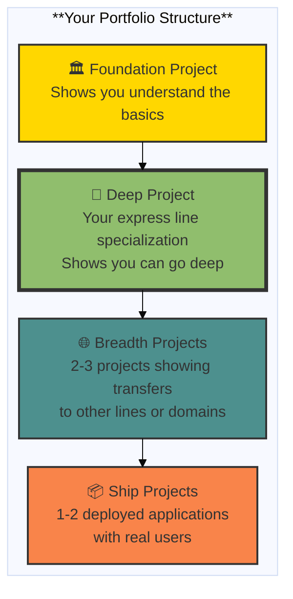

# Your portfolio should mirror the Metromap structur

```mermaid
---
config:
  theme: base
  layout: elk
---
graph TD
    subgraph "**Your Portfolio Structure**"
        F[🏛️ Foundation Project<br/>Shows you understand the basics]
        
        F --> D[🚀 Deep Project<br/>Your express line specialization<br/>Shows you can go deep]
        
        D --> B[🌐 Breadth Projects<br/>2-3 projects showing transfers<br/>to other lines or domains]
        
        B --> S[📦 Ship Projects<br/>1-2 deployed applications<br/>with real users]
    end
    
    style F fill:#ffd700,stroke:#333,stroke-width:2px
    style D fill:#90be6d,stroke:#333,stroke-width:4px
    style B fill:#4d908e,stroke:#333,stroke-width:2px
    style S fill:#f9844a,stroke:#333,stroke-width:2px
```
