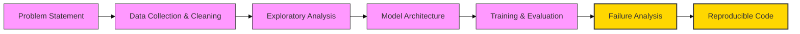

# ### What to Show

```mermaid
---
config:
  theme: base
  layout: elk
---
graph LR
    A[Problem Statement] --> B[Data Collection & Cleaning]
    B --> C[Exploratory Analysis]
    C --> D[Model Architecture]
    D --> E[Training & Evaluation]
    E --> F[Failure Analysis]
    F --> G[Reproducible Code]
    
    style A fill:#f9f,stroke:#333,stroke-width:1px
    style B fill:#f9f,stroke:#333,stroke-width:1px
    style C fill:#f9f,stroke:#333,stroke-width:1px
    style D fill:#f9f,stroke:#333,stroke-width:1px
    style E fill:#f9f,stroke:#333,stroke-width:1px
    style F fill:#ffd700,stroke:#333,stroke-width:2px
    style G fill:#ffd700,stroke:#333,stroke-width:2px
```
