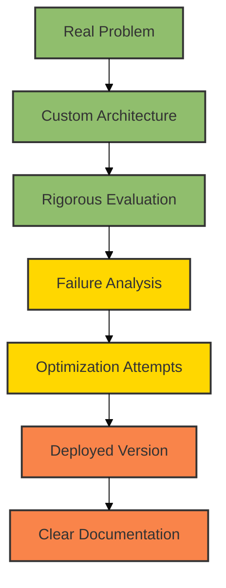

# ### What Makes a Deep Project Stand Out

```mermaid
---
config:
  theme: base
  layout: elk
---
graph TD
    A[Real Problem] --> B[Custom Architecture]
    B --> C[Rigorous Evaluation]
    C --> D[Failure Analysis]
    D --> E[Optimization Attempts]
    E --> F[Deployed Version]
    F --> G[Clear Documentation]
    
    style A fill:#90be6d,stroke:#333,stroke-width:2px
    style B fill:#90be6d,stroke:#333,stroke-width:2px
    style C fill:#90be6d,stroke:#333,stroke-width:2px
    style D fill:#ffd700,stroke:#333,stroke-width:2px
    style E fill:#ffd700,stroke:#333,stroke-width:2px
    style F fill:#f9844a,stroke:#333,stroke-width:2px
    style G fill:#f9844a,stroke:#333,stroke-width:2px
```
