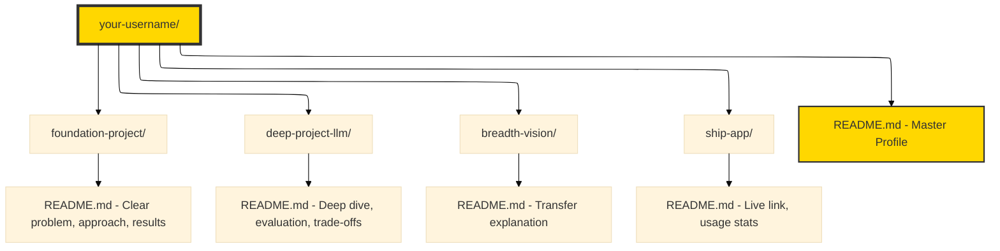

# ### Repository Structure Template

```mermaid
---
config:
  theme: base
  layout: elk
---
graph TD
    A[your-username/] --> B[foundation-project/]
    A --> C[deep-project-llm/]
    A --> D[breadth-vision/]
    A --> E[ship-app/]
    A --> F[README.md - Master Profile]
    
    B --> B1[README.md - Clear problem, approach, results]
    C --> C1[README.md - Deep dive, evaluation, trade-offs]
    D --> D1[README.md - Transfer explanation]
    E --> E1[README.md - Live link, usage stats]
    
    style A fill:#ffd700,stroke:#333,stroke-width:4px
    style F fill:#ffd700,stroke:#333,stroke-width:2px
```
