# The 2026 AI Metromap: From Passenger to Driver

## Building Your Portfolio Using the Metromap Structure

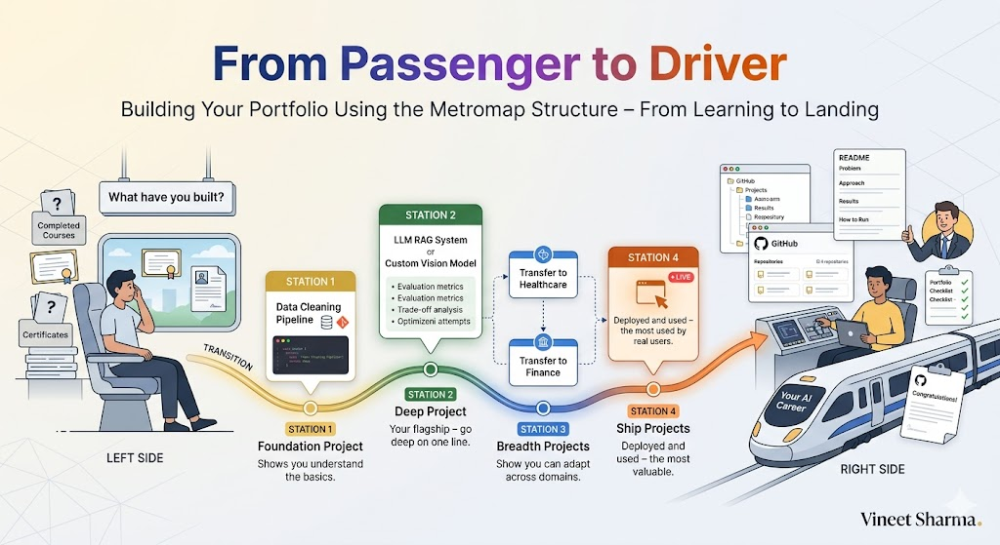


## 📖 Introduction

**Welcome to the final stop of the Master Arc.**

You've made it. You understand why linear learning fails. You've chosen your express line. You know how to avoid derailments. You have the map.

Now comes the question that separates passengers from drivers:

**"How do I prove I can actually do this?"**

You've learned. You've built. You've struggled. But when you apply for jobs, when you pitch clients, when you share your work—what do you show? A list of courses? Certificates? A GitHub full of tutorial forks?

In 2026, hiring managers don't care what you've *learned*. They care what you've *built*. They care about evidence. They care about portfolios.

But not just any portfolio. A portfolio built with **intention**. A portfolio that tells a story. A portfolio that demonstrates depth in one express line while showing breadth across the map.

This story—**The 2026 AI Metromap: From Passenger to Driver**—is your portfolio-building guide. We'll cover how to translate metromap "stops" into projects that hiring managers notice. We'll structure your GitHub for impact. We'll show you how to demonstrate the skills employers actually want.

**Let's get you in the driver's seat.**

---

## 📚 Where You Are in the Journey

### The Master Story Arc: The 2026 AI Metromap Series

- 🗺️ **[The 2026 AI Metromap: Why the Old Learning Routes Are Obsolete](#)** – A paradigm shift from linear learning to transit-system mastery. We diagnosed why traditional paths fail and introduced the metromap philosophy.

- 🧭 **[The 2026 AI Metromap: Reading the Map](#)** – Strategic navigation across the three core lines. We built decision frameworks for choosing your express line and transferring between tracks.

- 🎒 **[The 2026 AI Metromap: Avoiding Derailments](#)** – Diagnosing and preventing the "shiny object syndrome," foundation-skipping disasters, tutorial hell, and the comparison trap that kills momentum.

- 🏁 **The 2026 AI Metromap: From Passenger to Driver** – Translating metromap "stops" into portfolio projects that hiring managers actually notice. Project selection, documentation strategies, and demonstrating depth while showing breadth. **⬅️ YOU ARE HERE**

### The Complete Story Catalog

The Master Arc is complete. Your journey now continues into the series below. For a complete view of all upcoming stories across every series, visit the **[Complete 2026 AI Metromap Story Catalog](#)**.

**Your Next Stations:**

- 🏛️ **Series A: Foundations Station** – Deep dive into the skills that make everything else possible
- 📊 **Series B: Supervised Learning Line** – The classic route that built modern AI
- 🚀 **Series C: Modern Architecture Line** – The express train to cutting-edge AI
- ⚙️ **Series D: Engineering & Optimization Yard** – Production, deployment, and scale
- 🤖 **Series E: Applied AI & Agents Line** – Real-world applications across industries

---

## 🚂 Why Your Portfolio Matters More Than Your Resume

In 2026, the AI job market has transformed. Resumes are table stakes. Certificates are meaningless. What matters is **evidence**.

```mermaid
```

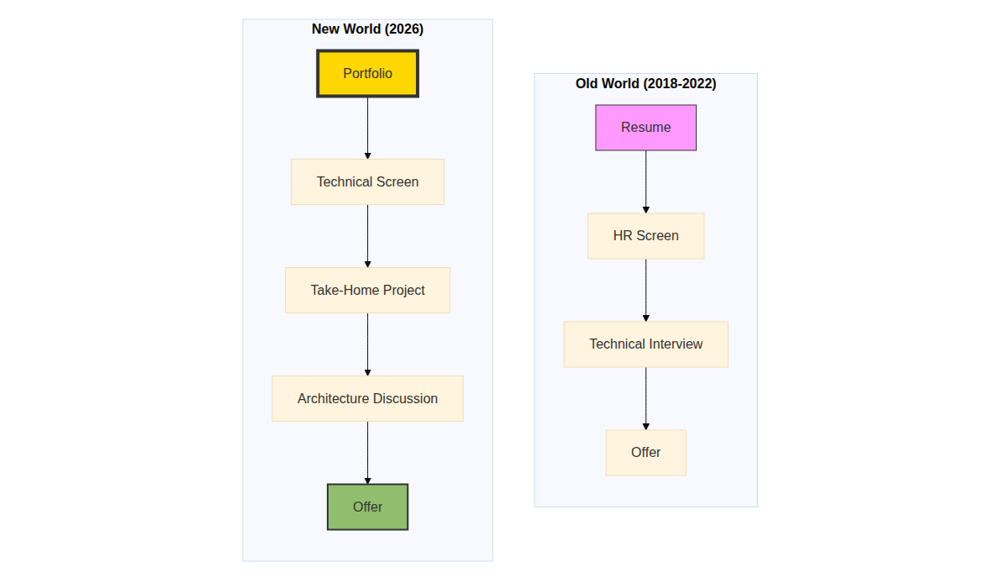

[View Source](https://github.com/Vineet-Sharma-Medium-Stories/Medium-Assets/blob/main/the-2026-ai-metromap-from-passenger-to-driver/diagram_01_in-2026-the-ai-job-market-has-transformed-resume-c24c.md)


**Why portfolios win:**

- **Resumes tell what you claim.** Portfolios show what you built.
- **Courses teach basics.** Projects prove you can handle complexity.
- **Certificates expire.** Deployed applications demonstrate current skills.
- **Interview questions test recall.** Portfolio discussions test real engineering.

**The hiring manager's question:** "Can you build what we need?"

Your portfolio answers that question before you walk in the door.

---

## 🗺️ The Metromap Portfolio Framework

Your portfolio should mirror the Metromap structure. Show depth in one express line, breadth across the map, and a strong foundation.

```mermaid
```

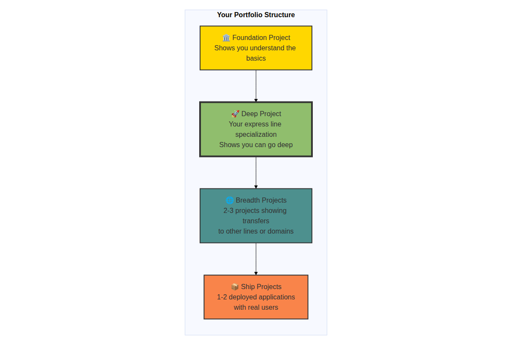

[View Source](https://github.com/Vineet-Sharma-Medium-Stories/Medium-Assets/blob/main/the-2026-ai-metromap-from-passenger-to-driver/diagram_02_your-portfolio-should-mirror-the-metromap-structur-eacd.md)


### The Four Project Types You Need

**1. Foundation Project (1 project)**

Shows you understand the basics. Not flashy, but essential. Proves you can clean data, train a model, and explain what's happening.

**2. Deep Project (1-2 projects)**

Your express line specialization. Shows you can go deep on one architecture or technique. This is your flagship. This is what hiring managers remember.

**3. Breadth Projects (2-3 projects)**

Shows you can transfer between lines. Demonstrates adaptability and range. Connects your specialization to different domains.

**4. Ship Projects (1-2 projects)**

Deployed applications with real users. Shows you can ship, not just train. This is the most valuable project type for industry roles.

---

## 🏛️ Foundation Project: The Non-Negotiable

### What It Is

A project that demonstrates you understand the fundamentals of ML engineering:

- Data cleaning and preprocessing
- Model training and evaluation
- Version control and reproducibility
- Basic explanation of your approach

### Why You Need It

Hiring managers need to know you can handle the 80% of work that isn't flashy. If you can't clean data, you can't build anything. This project proves you can.

### Project Ideas

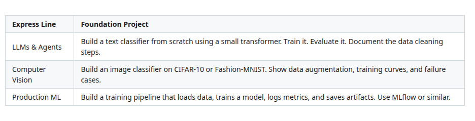

[View Source](https://github.com/Vineet-Sharma-Medium-Stories/Medium-Assets/blob/main/the-2026-ai-metromap-from-passenger-to-driver/table_01_project-ideas.md)


### What to Show

```mermaid
```

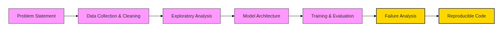

[View Source](https://github.com/Vineet-Sharma-Medium-Stories/Medium-Assets/blob/main/the-2026-ai-metromap-from-passenger-to-driver/diagram_03_what-to-show.md)


**Critical Elements:**
- **Failure analysis** – What went wrong? What would you improve? Shows maturity.
- **Reproducible code** – Can someone else run your code and get the same results?
- **Clear README** – What problem does this solve? How do I run it? What did you learn?

### Example Foundation Project Structure

```
project-churn-prediction/
├── README.md                    # Problem, approach, results, learnings
├── requirements.txt             # Dependencies
├── data/
│   ├── raw/                     # Original data
│   ├── processed/               # Cleaned data
│   └── cleaning.ipynb           # Cleaning steps documented
├── notebooks/
│   ├── 01-eda.ipynb            # Exploratory analysis
│   ├── 02-baseline.ipynb       # Simple model
│   └── 03-experiments.ipynb    # Iterative improvements
├── src/
│   ├── train.py                 # Training script
│   ├── evaluate.py              # Evaluation script
│   └── predict.py               # Inference script
├── models/
│   └── best_model.pkl           # Saved model
└── reports/
    ├── metrics.csv              # Training metrics
    └── final_report.md          # Summary findings
```

---

## 🚀 Deep Project: Your Express Line Specialization

### What It Is

A project that demonstrates deep expertise in your chosen express line. This is your flagship. This is what you talk about in interviews. This is what makes you memorable.

### Why You Need It

Generalists are common. Specialists are hired. A deep project shows you can go beyond tutorials, handle complexity, and solve real problems in your chosen area.

### Deep Project by Express Line

**Express Line 1: LLMs & Agents**

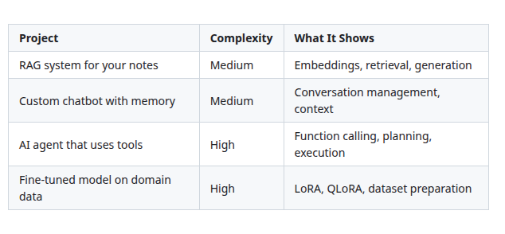

[View Source](https://github.com/Vineet-Sharma-Medium-Stories/Medium-Assets/blob/main/the-2026-ai-metromap-from-passenger-to-driver/table_02_express-line-1-llms--agents.md)


**Express Line 2: Computer Vision**

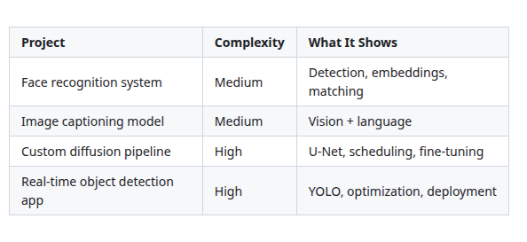

[View Source](https://github.com/Vineet-Sharma-Medium-Stories/Medium-Assets/blob/main/the-2026-ai-metromap-from-passenger-to-driver/table_03_express-line-2-computer-vision.md)


**Express Line 3: Production ML**

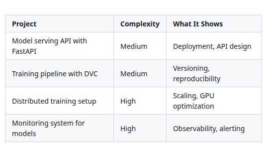

[View Source](https://github.com/Vineet-Sharma-Medium-Stories/Medium-Assets/blob/main/the-2026-ai-metromap-from-passenger-to-driver/table_04_express-line-3-production-ml.md)


### What Makes a Deep Project Stand Out

```mermaid
```

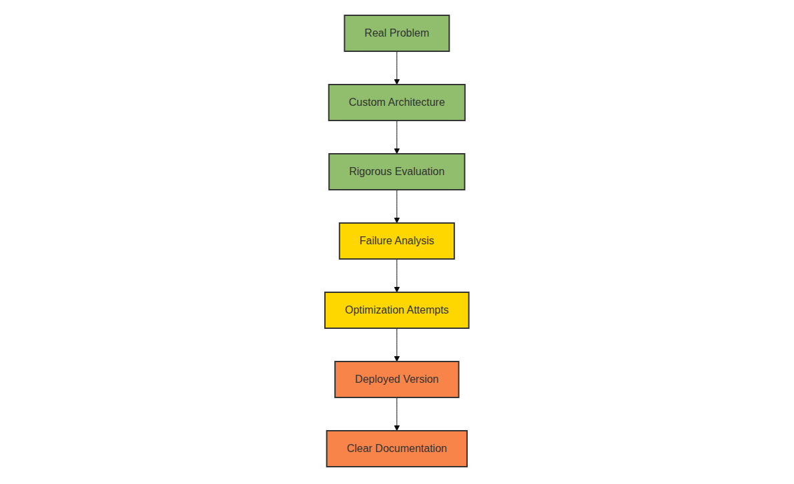

[View Source](https://github.com/Vineet-Sharma-Medium-Stories/Medium-Assets/blob/main/the-2026-ai-metromap-from-passenger-to-driver/diagram_04_what-makes-a-deep-project-stand-out-06c0.md)


**The Difference Between Good and Great:**

- **Good:** "I built a RAG chatbot using LangChain and OpenAI."
- **Great:** "I built a document Q&A system for medical research papers. I evaluated three embedding models (text-embedding-3-small, instructor-xl, e5-mistral) and found the trade-offs between latency and accuracy. I added hybrid search (dense + sparse) to improve recall by 23%. I deployed it with a simple Gradio interface and have 50 users from my university testing it."

The great version shows: **Evaluation, trade-offs, optimization, deployment, real users.**

---

## 🌐 Breadth Projects: Showing You Can Transfer

### What They Are

Projects that demonstrate your ability to transfer your skills to other lines or domains. They show you're adaptable, curious, and can apply your core skills to new problems.

### Why You Need Them

Hiring managers want people who can grow with the company. Breadth projects show you're not a one-trick pony. You can learn new domains, apply your skills, and solve problems outside your comfort zone.

### Breadth Project Ideas by Transfer

**From LLMs to Other Domains:**

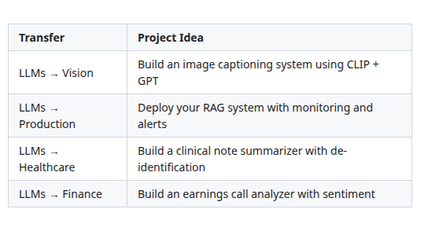

[View Source](https://github.com/Vineet-Sharma-Medium-Stories/Medium-Assets/blob/main/the-2026-ai-metromap-from-passenger-to-driver/table_05_from-llms-to-other-domains.md)


**From Vision to Other Domains:**

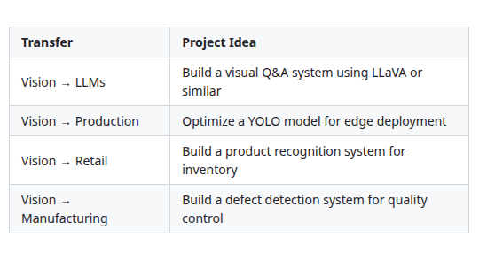

[View Source](https://github.com/Vineet-Sharma-Medium-Stories/Medium-Assets/blob/main/the-2026-ai-metromap-from-passenger-to-driver/table_06_from-vision-to-other-domains.md)


**From Production to Other Domains:**

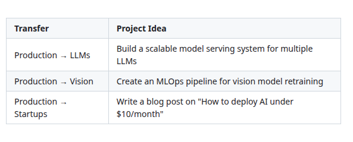

[View Source](https://github.com/Vineet-Sharma-Medium-Stories/Medium-Assets/blob/main/the-2026-ai-metromap-from-passenger-to-driver/table_07_from-production-to-other-domains-482e.md)


### How Many Breadth Projects?

**2-3 projects maximum.** Quality over quantity. Each breadth project should be a complete, well-documented piece of work, not a half-finished experiment.

---

## 📦 Ship Projects: Deployed and Used

### What They Are

Projects that are actually deployed and have real users. Not running on your laptop. Not in a Jupyter notebook. Live. Accessible. Used.

### Why You Need Them

This is the most valuable project type for industry roles. It proves you can:

- Take a model from notebook to production
- Handle deployment constraints (latency, cost, scaling)
- Build something real people can use
- Maintain and iterate on a live system

### Ship Project Ideas by Scale

**Tier 1: Simple Deployment (1-2 weeks)**

- Hugging Face Space with Gradio interface
- Streamlit app on Render or Railway
- FastAPI on a free cloud tier

**Tier 2: Real Users (1-2 months)**

- Twitter/X bot that does something useful
- Slack bot for your community
- Chrome extension with AI features
- Simple SaaS with 50+ users

**Tier 3: Production Scale (2-4 months)**

- Deployed on cloud with autoscaling
- Monitoring and alerting
- User authentication and data persistence
- 100+ daily active users

### The 70% Rule

Your project doesn't need to be perfect to ship. **Ship at 70%.** Get it in front of users. Get feedback. Iterate.

The perfect project that never ships is worth nothing. The imperfect project with 100 users is worth everything.

---

## 📁 Structuring Your GitHub for Impact

Your GitHub is your portfolio's home. Structure it for clarity, not complexity.

### Repository Structure Template

```mermaid
```

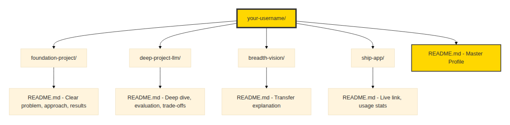

[View Source](https://github.com/Vineet-Sharma-Medium-Stories/Medium-Assets/blob/main/the-2026-ai-metromap-from-passenger-to-driver/diagram_05_repository-structure-template.md)


### The Master README (Your Profile)

Your GitHub profile README is your front door. Make it count:

```markdown
# 👋 I'm [Your Name]

## 🚀 AI Engineer specializing in [Your Express Line]

### What I Build

- **🔍 [Foundation Project]** – [Brief description, what it shows]
- **🤖 [Deep Project]** – [Brief description, key metrics, trade-offs]
- **🌐 [Breadth Project]** – [Brief description, transfer demonstrated]
- **📦 [Ship Project]** – [Live link, user count]

### My Learning Journey

I follow the Metromap framework:
- 🏛️ **Foundations:** [Completed projects]
- 🚀 **Express Line:** [My specialization]
- 🏥 **Applied:** [Domains I've explored]

### Connect With Me

[LinkedIn] [Twitter] [Personal Site]
```

### Project README Structure

Every project should have a README that answers these questions:

1. **What problem does this solve?** (One sentence)
2. **Why did you build this?** (Motivation)
3. **What did you try?** (Approach, alternatives considered)
4. **What worked?** (Results, metrics)
5. **What would you improve?** (Honest reflection)
6. **How do I run it?** (Clear instructions)

---

## 🎯 The Portfolio Checklist

Before you share your portfolio, run through this checklist:

### Foundation Project
- [ ] Clear problem statement
- [ ] Data cleaning steps documented
- [ ] Model architecture explained
- [ ] Evaluation metrics shown
- [ ] Failure cases analyzed
- [ ] Reproducible code
- [ ] Clear README

### Deep Project
- [ ] Solves a real problem (not a toy dataset)
- [ ] Multiple approaches evaluated
- [ ] Trade-offs documented (accuracy vs latency, etc.)
- [ ] Optimizations attempted
- [ ] Failure analysis
- [ ] Deployed or deployable
- [ ] README with deep technical detail

### Breadth Projects (2-3)
- [ ] Clear transfer story (from your express line to new domain)
- [ ] Core skills still visible
- [ ] Each project stands alone
- [ ] READMEs show learning process

### Ship Projects (1-2)
- [ ] Live URL that works
- [ ] Real users (or clear path to get users)
- [ ] Basic monitoring (even just logs)
- [ ] Deployment documented

### GitHub Profile
- [ ] Profile README introduces you
- [ ] Pinned repositories show your best work
- [ ] Consistent README quality across projects
- [ ] Code is clean and commented
- [ ] No tutorial forks (or they're clearly marked)

---

## 📊 Takeaway from This Story

**What You Learned:**

- **The Four Project Types** – Foundation, Deep, Breadth, Ship. Each serves a different purpose in your portfolio.

- **The Metromap Portfolio Structure** – Mirror the map in your projects. Show depth in one express line, breadth across the map.

- **What Makes Projects Stand Out** – Evaluation, trade-offs, failure analysis, optimization, deployment, real users.

- **GitHub Structure** – How to organize your repositories for maximum impact.

- **The Portfolio Checklist** – A clear list to validate your portfolio before sharing.

**The Most Important Lesson:**

You don't need 20 projects. You need **4-6 excellent projects** that tell a story:

- I have foundations (1 project)
- I specialize in this area (1-2 projects)
- I can adapt to new domains (2-3 projects)
- I can ship to real users (1-2 projects)

This structure shows hiring managers everything they need to know.

---

## 🔗 Navigation

- **⬅️ Previous Story:** [The 2026 AI Metromap: Avoiding Derailments](#)

- **📚 Story Catalog:** [Complete 2026 AI Metromap Story Catalog](#) – Your complete navigation guide to all 39+ stories across every series.

- **➡️ Your Next Station:** Your journey continues into the series. Choose your path:

  - 🏛️ **[Series A: Foundations Station](#)** – Start here if you want to deepen your fundamentals
  - 📊 **[Series B: Supervised Learning Line](#)** – Take the classic route to ML mastery
  - 🚀 **[Series C: Modern Architecture Line](#)** – Board the express train to cutting-edge AI
  - ⚙️ **[Series D: Engineering & Optimization Yard](#)** – Build production-ready systems
  - 🤖 **[Series E: Applied AI & Agents Line](#)** – Build real-world applications

---

## 📝 Your Invitation

The Master Arc is complete. You now have the map, the navigation skills, the derailment prevention, and the portfolio framework.

**Your next step:**

1. **Choose your series** – Which express line will you ride?
2. **Audit your current portfolio** – Using the checklist, what's missing?
3. **Start your first project** – Not tomorrow. Today. Even if it's just the README.

Share your portfolio or your project idea in the comments. Let's build together.

---

*Found this helpful? Clap, comment, and share your portfolio journey. The Master Arc is complete. Your journey through the series begins now. See you at the next station!* 🚇