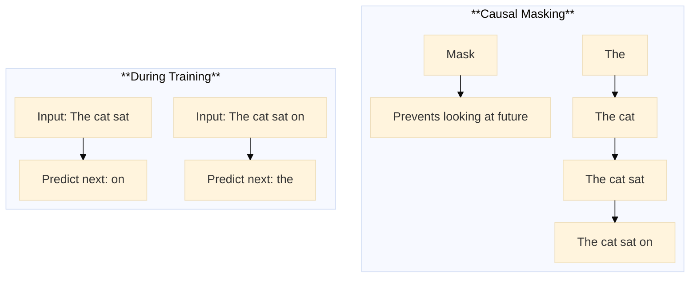

# The key innovation in decoder-only models is **cau

```mermaid
---
config:
  theme: base
  layout: elk
---
graph TD
    subgraph "**Causal Masking**"
        T1[The] --> T2[The cat]
        T2 --> T3[The cat sat]
        T3 --> T4[The cat sat on]
        
        M[Mask] --> P[Prevents looking at future]
    end
    
    subgraph "**During Training**"
        I[Input: The cat sat] --> L[Predict next: on]
        I2[Input: The cat sat on] --> L2[Predict next: the]
    end
```
