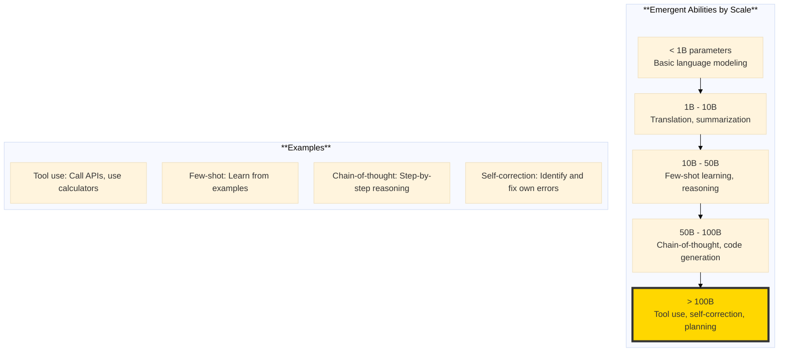

# At certain scales, models develop abilities that w

```mermaid
---
config:
  theme: base
  layout: elk
---
graph TD
    subgraph "**Emergent Abilities by Scale**"
        S1[< 1B parameters<br/>Basic language modeling] --> S2[1B - 10B<br/>Translation, summarization]
        S2 --> S3[10B - 50B<br/>Few-shot learning, reasoning]
        S3 --> S4[50B - 100B<br/>Chain-of-thought, code generation]
        S4 --> S5[> 100B<br/>Tool use, self-correction, planning]
    end
    
    subgraph "**Examples**"
        E1[Few-shot: Learn from examples]
        E2[Chain-of-thought: Step-by-step reasoning]
        E3[Tool use: Call APIs, use calculators]
        E4[Self-correction: Identify and fix own errors]
    end
    
    style S5 fill:#ffd700,stroke:#333,stroke-width:4px
```
