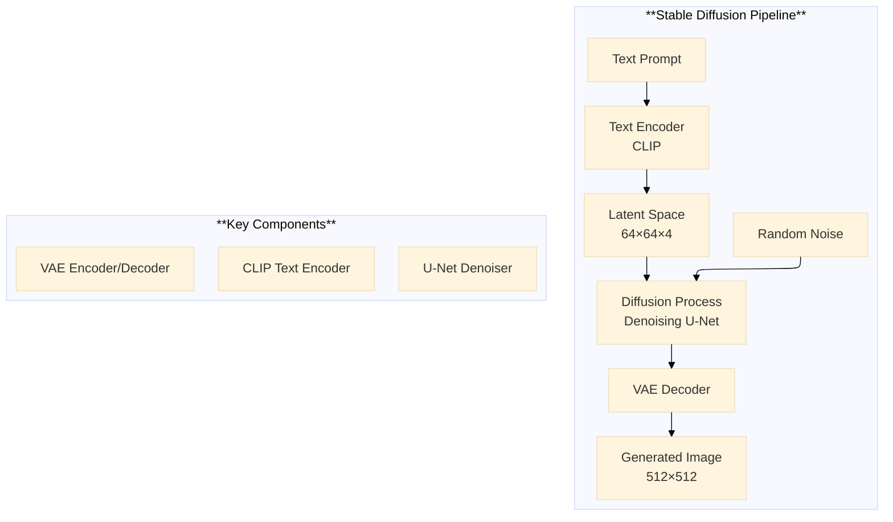

# Stable Diffusion is the most popular open-source t

```mermaid
---
config:
  theme: base
  layout: elk
---
graph TD
    subgraph "**Stable Diffusion Pipeline**"
        T[Text Prompt] --> TE[Text Encoder<br/>CLIP]
        TE --> L[Latent Space<br/>64×64×4]
        
        N[Random Noise] --> D[Diffusion Process<br/>Denoising U-Net]
        L --> D
        D --> V[VAE Decoder]
        V --> I[Generated Image<br/>512×512]
    end
    
    subgraph "**Key Components**"
        C1[CLIP Text Encoder]
        C2[U-Net Denoiser]
        C3[VAE Encoder/Decoder]
    end
```
