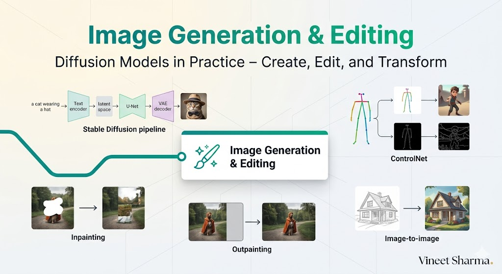

# The 2026 AI Metromap: Image Generation & Editing – Diffusion Models in Practice

## Series E: Applied AI & Agents Line | Story 6 of 15+



## 📖 Introduction

**Welcome to the sixth stop on the Applied AI & Agents Line.**

In our last story, we mastered computer vision—OCR, face recognition, object detection, and segmentation. Your systems can now see, read, and understand visual information. You've built applications that extract text from documents, identify faces, and detect objects in real-time.

But there's another side to visual AI: **creation**.

What if your AI could generate images from text descriptions? What if it could edit photos, remove objects, change styles, or even create entirely new scenes? What if you could generate a photorealistic image of anything you can describe?

Welcome to the world of generative AI and diffusion models.

Diffusion models have revolutionized image generation. Stable Diffusion, DALL-E, Midjourney—these tools can create stunning images from simple text prompts. But beyond generation, diffusion models enable powerful editing capabilities: inpainting (removing objects), outpainting (extending images), image-to-image (style transfer), and fine-tuning with custom concepts.

This story—**The 2026 AI Metromap: Image Generation & Editing – Diffusion Models in Practice**—is your guide to building generative AI applications. We'll master Stable Diffusion pipelines for text-to-image generation. We'll implement ControlNet for precise control over composition and pose. We'll explore inpainting and outpainting for image editing. And we'll fine-tune diffusion models with DreamBooth to generate custom concepts.

**Let's create something new.**

---

## 📚 Where You Are in the Journey

### The Master Story Arc: The 2026 AI Metromap Series (Complete)

- 🗺️ **[The 2026 AI Metromap: Why the Old Learning Routes Are Obsolete](#)** – A paradigm shift from linear learning to transit-system mastery.
- 🧭 **[The 2026 AI Metromap: Reading the Map](#)** – Strategic navigation across the three core lines.
- 🎒 **[The 2026 AI Metromap: Avoiding Derailments](#)** – Diagnosing and preventing the most common learning pitfalls.
- 🏁 **[The 2026 AI Metromap: From Passenger to Driver](#)** – Building your portfolio using the Metromap structure.

### Series A: Foundations Station (Complete)
### Series B: Supervised Learning Line (Complete)
### Series C: Modern Architecture Line (Complete)
### Series D: Engineering & Optimization Yard (Complete)

### Series E: Applied AI & Agents Line (15+ Stories)

- 💬 **[The 2026 AI Metromap: Prompt Engineering 101 – The Art of Talking to AI](#)** – System prompts; few-shot prompting; chain-of-thought; tree of thoughts; self-consistency; prompt templates; building robust prompts for production.

- 📚 **[The 2026 AI Metromap: RAG – Retrieval-Augmented Generation for Knowledge-Intensive Tasks](#)** – Vector databases (Chroma, Pinecone, Weaviate, Milvus); embedding models; semantic search; hybrid search; reranking; building a document Q&A system.

- 🤖 **[The 2026 AI Metromap: AI Agents & Autonomous Workflows – The Self-Driving Trains](#)** – Agent architectures (ReAct, Plan-and-Execute, AutoGPT); tool use and function calling; multi-agent systems; memory management.

- 🗣️ **[The 2026 AI Metromap: Voice Assistants & Speech Models – Making AI Talk](#)** – Speech-to-text (Whisper); text-to-speech (ElevenLabs, Coqui); voice activity detection; real-time transcription.

- 👁️ **[The 2026 AI Metromap: Computer Vision Projects – From OCR to Face Recognition](#)** – Optical character recognition (Tesseract, TrOCR); face detection and recognition; object detection (YOLO, DETR); image segmentation.

- 🎨 **The 2026 AI Metromap: Image Generation & Editing – Diffusion Models in Practice** – Stable diffusion pipelines; ControlNet; inpainting; outpainting; image-to-image; fine-tuning diffusion models with DreamBooth. **⬅️ YOU ARE HERE**

**NLP & Specialized Tasks**
- 🔤 **[The 2026 AI Metromap: NLP Tasks – NER, Translation, Summarization, and Beyond](#)** – Named entity recognition; machine translation; text summarization (extractive and abstractive); sentiment analysis. 🔜 *Up Next*

- 📈 **[The 2026 AI Metromap: Time Series Forecasting – ARIMA, LSTM, and Transformers](#)** – Classical methods (ARIMA, SARIMA); LSTM networks; Transformer for time series; forecasting stock prices, weather, and demand.

- 👍 **[The 2026 AI Metromap: Recommendation Systems – From Collaborative Filtering to Two-Tower Networks](#)** – Content-based filtering; collaborative filtering; matrix factorization; neural collaborative filtering; two-tower architectures.

**Industry Applications**
- 🏥 **[The 2026 AI Metromap: AI in Healthcare – Medical Research, Diagnostics, and Wellness](#)** – Medical imaging; EHR analysis; drug discovery; clinical decision support; regulatory considerations.

- 💰 **[The 2026 AI Metromap: AI in Finance – Banking, Insurance, and Trading](#)** – Fraud detection; algorithmic trading; credit scoring; risk management; explainable AI for compliance.

- 🎮 **[The 2026 AI Metromap: AI in Gaming, VR/AR, and Entertainment](#)** – Procedural content generation; NPC behavior with LLMs; AI-driven storytelling; game testing automation.

- 🏭 **[The 2026 AI Metromap: AI in Robotics, Manufacturing, and Supply Chain](#)** – Computer vision for quality control; predictive maintenance; autonomous navigation; warehouse optimization.

- 🌱 **[The 2026 AI Metromap: AI for Social Good – Climate Action, Agriculture, and Sustainability](#)** – Crop yield prediction; climate modeling; energy optimization; wildlife conservation; disaster response.

- 🎓 **[The 2026 AI Metromap: AI in Education – Personalized Learning and Training](#)** – Intelligent tutoring systems; automated grading; personalized content recommendation; adaptive learning paths.

### The Complete Story Catalog

For a complete view of all upcoming stories across every series, visit the **[Complete 2026 AI Metromap Story Catalog](#)**.

---

## 🎨 Stable Diffusion: Text-to-Image Generation

Stable Diffusion is the most popular open-source text-to-image model. It operates in latent space for efficiency.

```mermaid
```

](images/diagram_01_stable-diffusion-is-the-most-popular-open-source-t-f46e.png)

[View Source](https://github.com/Vineet-Sharma-Medium-Stories/Medium-Assets/blob/main/the-2026-ai-metromap-image-generation--editing--diffusion-models-in-practice/diagram_01_stable-diffusion-is-the-most-popular-open-source-t-f46e.md)


```python
def stable_diffusion_basic():
    """Basic text-to-image generation with Stable Diffusion"""
    
    print("="*60)
    print("STABLE DIFFUSION: TEXT-TO-IMAGE")
    print("="*60)
    
    print("""
    # Install: pip install diffusers transformers accelerate
    
    import torch
    from diffusers import StableDiffusionPipeline
    from PIL import Image
    
    # Load model
    model_id = "runwayml/stable-diffusion-v1-5"
    pipe = StableDiffusionPipeline.from_pretrained(
        model_id,
        torch_dtype=torch.float16
    )
    pipe = pipe.to("cuda")
    
    # Generate image
    prompt = "a beautiful sunset over mountains, digital art, vibrant colors"
    negative_prompt = "blurry, low quality, distorted"
    
    image = pipe(
        prompt=prompt,
        negative_prompt=negative_prompt,
        num_inference_steps=50,
        guidance_scale=7.5,
        height=512,
        width=512
    ).images[0]
    
    image.save("generated_image.png")
    
    # Different model variants
    models = {
        "Stable Diffusion 1.5": "runwayml/stable-diffusion-v1-5",
        "Stable Diffusion 2.1": "stabilityai/stable-diffusion-2-1",
        "Stable Diffusion XL": "stabilityai/stable-diffusion-xl-base-1.0",
        "SDXL Turbo": "stabilityai/sdxl-turbo",  # 1-step generation
        "LCM-LoRA": "latent-consistency/lcm-lora-sdv1-5"  # Faster inference
    }
    
    # Optimizations for faster generation
    pipe.enable_attention_slicing()  # Reduce memory
    pipe.enable_xformers_memory_efficient_attention()  # Faster, if installed
    pipe.enable_model_cpu_offload()  # For memory-constrained GPUs
    
    # Batch generation
    prompts = [
        "a cat sitting on a mat",
        "a dog playing in the park",
        "a car driving on a highway"
    ]
    
    images = pipe(prompts, num_inference_steps=30).images
    for i, img in enumerate(images):
        img.save(f"batch_{i}.png")
    """)
    
    print("\n" + "="*60)
    print("PROMPT ENGINEERING FOR IMAGES")
    print("="*60)
    
    prompt_tips = [
        "Be specific: 'a fluffy orange cat wearing a wizard hat' > 'a cat'",
        "Add style: 'digital art', 'oil painting', 'photorealistic', 'anime'",
        "Add quality keywords: 'masterpiece', 'highly detailed', '8k'",
        "Use negative prompts: 'blurry, low quality, distorted, ugly'",
        "Control composition: 'centered', 'wide shot', 'close-up'",
        "Add lighting: 'golden hour', 'studio lighting', 'cinematic'"
    ]
    
    print("\nPrompt Engineering Tips:")
    for tip in prompt_tips:
        print(f"  • {tip}")

stable_diffusion_basic()
```

---

## 🖌️ ControlNet: Precise Control Over Generation

ControlNet adds spatial control to diffusion models—pose, edges, depth, segmentation maps.

```python
def controlnet():
    """Implement ControlNet for controlled image generation"""
    
    print("="*60)
    print("CONTROLNET: PRECISE CONTROL")
    print("="*60)
    
    print("""
    # Install: pip install controlnet_aux
    
    import torch
    from diffusers import StableDiffusionControlNetPipeline, ControlNetModel
    from controlnet_aux import OpenposeDetector, CannyDetector, DepthEstimator
    from PIL import Image
    
    # Load ControlNet model
    controlnet = ControlNetModel.from_pretrained(
        "lllyasviel/sd-controlnet-openpose",
        torch_dtype=torch.float16
    )
    
    pipe = StableDiffusionControlNetPipeline.from_pretrained(
        "runwayml/stable-diffusion-v1-5",
        controlnet=controlnet,
        torch_dtype=torch.float16
    )
    pipe = pipe.to("cuda")
    
    # 1. POSE CONTROL (OpenPose)
    openpose = OpenposeDetector.from_pretrained("lllyasviel/ControlNet")
    
    # Load pose reference image
    pose_image = Image.open("pose_reference.jpg")
    pose = openpose(pose_image)
    
    # Generate image with same pose
    image = pipe(
        prompt="a warrior in armor",
        image=pose,
        num_inference_steps=30
    ).images[0]
    
    # 2. EDGE CONTROL (Canny)
    canny = CannyDetector()
    edge_image = canny(pose_image, low_threshold=100, high_threshold=200)
    
    image = pipe(
        prompt="a beautiful landscape",
        image=edge_image,
        num_inference_steps=30
    ).images[0]
    
    # 3. DEPTH CONTROL
    depth = DepthEstimator.from_pretrained("lllyasviel/ControlNet")
    depth_image = depth(pose_image)
    
    image = pipe(
        prompt="a room interior",
        image=depth_image,
        num_inference_steps=30
    ).images[0]
    
    # Available ControlNet models
    controlnet_models = {
        "OpenPose": "lllyasviel/sd-controlnet-openpose",
        "Canny": "lllyasviel/sd-controlnet-canny",
        "Depth": "lllyasviel/sd-controlnet-depth",
        "HED (Soft Edges)": "lllyasviel/sd-controlnet-hed",
        "Scribble": "lllyasviel/sd-controlnet-scribble",
        "Segmentation": "lllyasviel/sd-controlnet-seg",
        "MLSD (Lines)": "lllyasviel/sd-controlnet-mlsd",
        "Normal Map": "lllyasviel/sd-controlnet-normal"
    }
    """)
    
    print("\n" + "="*60)
    print("CONTROLNET APPLICATIONS")
    print("="*60)
    
    apps = [
        ("Pose Transfer", "Generate characters in specific poses"),
        ("Sketch to Image", "Turn rough sketches into detailed images"),
        ("Scene Layout", "Control object placement with segmentation"),
        ("Style Transfer", "Maintain structure while changing style"),
        ("Product Design", "Generate variations with consistent structure")
    ]
    
    for app, desc in apps:
        print(f"  • {app}: {desc}")

controlnet()
```

---

## 🧹 Inpainting: Removing and Replacing Objects

Inpainting allows you to remove objects or replace them with something else.

```python
def inpainting():
    """Implement inpainting for object removal and replacement"""
    
    print("="*60)
    print("INPAINTING: OBJECT REMOVAL & REPLACEMENT")
    print("="*60)
    
    print("""
    from diffusers import StableDiffusionInpaintPipeline
    from PIL import Image
    import numpy as np
    import cv2
    
    # Load inpainting pipeline
    pipe = StableDiffusionInpaintPipeline.from_pretrained(
        "runwayml/stable-diffusion-inpainting",
        torch_dtype=torch.float16
    )
    pipe = pipe.to("cuda")
    
    # Load image and create mask
    image = Image.open("photo.jpg").convert("RGB")
    
    # Create mask (white = area to replace)
    mask = Image.new("L", image.size, 0)
    # Mark area to remove (e.g., a person)
    # In practice, you'd use segmentation to get mask
    
    # Generate new content
    prompt = "a beautiful garden with flowers"
    
    result = pipe(
        prompt=prompt,
        image=image,
        mask_image=mask,
        num_inference_steps=50,
        guidance_scale=7.5
    ).images[0]
    
    # Automatic mask generation with SAM (Segment Anything)
    from segment_anything import sam_model_registry, SamAutomaticMaskGenerator
    
    sam = sam_model_registry["vit_h"](checkpoint="sam_vit_h.pth")
    generator = SamAutomaticMaskGenerator(sam)
    
    # Generate masks for image
    masks = generator.generate(np.array(image))
    
    # Use the largest mask as inpainting area
    largest_mask = max(masks, key=lambda x: x['area'])
    mask = Image.fromarray(largest_mask['segmentation'])
    
    # Inpaint
    result = pipe(prompt=prompt, image=image, mask_image=mask).images[0]
    
    # Object removal (replace with background)
    remove_prompt = ""  # Empty prompt removes objects
    result = pipe(prompt=remove_prompt, image=image, mask_image=mask).images[0]
    """)
    
    print("\n" + "="*60)
    print("INPAINTING APPLICATIONS")
    print("="*60)
    
    apps = [
        ("Photo Editing", "Remove unwanted objects, people, blemishes"),
        ("Product Photography", "Replace backgrounds, add props"),
        ("Creative Design", "Replace elements while preserving composition"),
        ("Content-Aware Fill", "Fill missing areas in images"),
        ("Restoration", "Repair damaged photos")
    ]
    
    for app, desc in apps:
        print(f"  • {app}: {desc}")

inpainting()
```

---

## 🌅 Outpainting: Extending Images Beyond Borders

Outpainting extends images beyond their original boundaries.

```python
def outpainting():
    """Implement outpainting to extend images"""
    
    print("="*60)
    print("OUTPAINTING: EXTENDING IMAGES")
    print("="*60)
    
    print("""
    from diffusers import StableDiffusionOutpaintPipeline
    from PIL import Image
    
    # Load outpainting pipeline
    pipe = StableDiffusionOutpaintPipeline.from_pretrained(
        "stabilityai/stable-diffusion-2-inpainting",
        torch_dtype=torch.float16
    )
    pipe = pipe.to("cuda")
    
    # Load image to extend
    image = Image.open("portrait.jpg").convert("RGB")
    
    # Extend to the right
    result = pipe(
        prompt="beautiful landscape background",
        image=image,
        left=0,
        right=512,  # Pixels to add to right
        top=0,
        bottom=0
    ).images[0]
    
    # Extend in all directions
    result = pipe(
        prompt="fantasy forest, magical atmosphere",
        image=image,
        left=512,
        right=512,
        top=512,
        bottom=512
    ).images[0]
    
    # Custom outpainting function
    def outpaint_wide(image, target_width, prompt):
        \"\"\"Extend image to target width\"\"\"
        width, height = image.size
        if target_width <= width:
            return image
        
        # Create mask for right side
        mask = Image.new("L", image.size, 0)
        # Continue generating until reaching target width
        current = image
        while current.width < target_width:
            # Generate next chunk
            next_chunk = pipe(
                prompt=prompt,
                image=current,
                left=0,
                right=512,
                top=0,
                bottom=0
            ).images[0]
            current = next_chunk
        
        return current
    """)
    
    print("\n" + "="*60)
    print("OUTPAINTING APPLICATIONS")
    print("="*60)
    
    apps = [
        ("Wide-Angle Conversion", "Convert portrait to landscape"),
        ("Panorama Creation", "Stitch and extend images"),
        ("Artistic Expansion", "Continue artwork beyond canvas"),
        ("Wallpaper Generation", "Extend to any aspect ratio"),
        ("Scene Completion", "Complete partial scenes")
    ]
    
    for app, desc in apps:
        print(f"  • {app}: {desc}")

outpainting()
```

---

## 🔄 Image-to-Image: Style Transfer and Variation

Image-to-image transforms input images while preserving structure.

```python
def image_to_image():
    """Implement image-to-image for style transfer"""
    
    print("="*60)
    print("IMAGE-TO-IMAGE: STYLE TRANSFER")
    print("="*60)
    
    print("""
    from diffusers import StableDiffusionImg2ImgPipeline
    from PIL import Image
    
    # Load img2img pipeline
    pipe = StableDiffusionImg2ImgPipeline.from_pretrained(
        "runwayml/stable-diffusion-v1-5",
        torch_dtype=torch.float16
    )
    pipe = pipe.to("cuda")
    
    # Load input image
    init_image = Image.open("sketch.jpg").convert("RGB")
    
    # Resize to target dimensions
    init_image = init_image.resize((512, 512))
    
    # Generate variation
    prompt = "a beautiful watercolor painting of a landscape"
    
    result = pipe(
        prompt=prompt,
        image=init_image,
        strength=0.75,  # How much to change (0 = no change, 1 = completely new)
        num_inference_steps=50,
        guidance_scale=7.5
    ).images[0]
    
    # Different strength values
    # strength=0.2: Minor adjustments, preserve original
    # strength=0.5: Moderate changes
    # strength=0.8: Major transformation
    
    # Style transfer
    style_prompts = {
        "Van Gogh": "in the style of Van Gogh, oil painting, impasto",
        "Cyberpunk": "cyberpunk style, neon lights, futuristic",
        "Watercolor": "watercolor painting, soft colors, artistic",
        "Anime": "anime style, cel shading, vibrant colors"
    }
    
    for style, prompt in style_prompts.items():
        result = pipe(
            prompt=prompt,
            image=init_image,
            strength=0.7
        ).images[0]
        result.save(f"style_{style}.png")
    """)
    
    print("\n" + "="*60)
    print("STRENGTH VALUES GUIDE")
    print("="*60)
    
    strengths = [
        (0.1-0.3, "Minor adjustments", "Color correction, small fixes"),
        (0.4-0.6, "Moderate changes", "Style influence, enhancements"),
        (0.7-0.9, "Major transformation", "Complete style change, reinterpretation")
    ]
    
    for strength, level, use in strengths:
        print(f"  • {strength}: {level} - {use}")

image_to_image()
```

---

## 🎭 DreamBooth: Fine-Tuning with Custom Concepts

DreamBooth fine-tunes diffusion models to generate specific subjects (people, objects, styles).

```python
def dreambooth():
    """Fine-tune diffusion models with DreamBooth"""
    
    print("="*60)
    print("DREAMBOOTH: CUSTOM CONCEPTS")
    print("="*60)
    
    print("""
    # Using HuggingFace Diffusers
    from diffusers import DiffusionPipeline, StableDiffusionPipeline
    from diffusers.training_utils import train_dreambooth
    
    # Prepare dataset of 5-20 images of your subject
    # Images should be varied (different angles, lighting, backgrounds)
    
    # Example: Training to generate a specific dog
    # Images should be named with a unique identifier like "sks dog"
    
    # Training script (simplified)
    # python train_dreambooth.py \\
    #   --pretrained_model_name_or_path="runwayml/stable-diffusion-v1-5" \\
    #   --instance_data_dir="./dog_photos" \\
    #   --class_data_dir="./class_dog" \\
    #   --output_dir="./dreambooth-dog" \\
    #   --instance_prompt="a photo of sks dog" \\
    #   --class_prompt="a photo of a dog" \\
    #   --resolution=512 \\
    #   --train_batch_size=1 \\
    #   --gradient_accumulation_steps=1 \\
    #   --learning_rate=5e-6 \\
    #   --lr_scheduler="constant" \\
    #   --lr_warmup_steps=0 \\
    #   --num_class_images=200 \\
    #   --max_train_steps=800
    
    # After training, use the fine-tuned model
    pipe = StableDiffusionPipeline.from_pretrained("./dreambooth-dog")
    
    # Generate your custom subject
    image = pipe("a photo of sks dog sitting on a throne").images[0]
    image.save("custom_dog.png")
    
    # Generate in different styles
    styles = [
        "a watercolor painting of sks dog",
        "sks dog in space, astronaut helmet",
        "sks dog as a Renaissance painting",
        "sks dog in the style of Picasso"
    ]
    
    for style in styles:
        image = pipe(style).images[0]
        image.save(f"dog_{style[:20]}.png")
    """)
    
    print("\n" + "="*60)
    print("DREAMBOOTH APPLICATIONS")
    print("="*60)
    
    apps = [
        ("Personal Portraits", "Generate yourself in any style"),
        ("Product Visualization", "Your product in different settings"),
        ("Character Consistency", "Same character across scenes"),
        ("Brand Assets", "Generate consistent brand imagery"),
        ("Pet Portraits", "Generate your pet in various styles")
    ]
    
    for app, desc in apps:
        print(f"  • {app}: {desc}")
    
    print("\n" + "="*60)
    print("TRAINING TIPS")
    print("="*60)
    
    tips = [
        "• Use 10-30 high-quality, varied images",
        "• Include different angles, lighting, backgrounds",
        "• Use a unique identifier (e.g., 'sks', 'zwx')",
        "• Train for 500-1000 steps (not too many)",
        "• Use class images to prevent overfitting",
        "• Test with different prompts after training"
    ]
    
    for tip in tips:
        print(f"  {tip}")

dreambooth()
```

---

## 🚀 Complete Image Generation Pipeline

```python
def image_generation_pipeline():
    """Complete image generation and editing pipeline"""
    
    print("="*60)
    print("COMPLETE IMAGE GENERATION PIPELINE")
    print("="*60)
    
    print("""
    class ImageGenerator:
        \"\"\"Complete image generation and editing system\"\"\"
        
        def __init__(self):
            self.device = "cuda" if torch.cuda.is_available() else "cpu"
            
            # Load models
            self.txt2img = StableDiffusionPipeline.from_pretrained(
                "runwayml/stable-diffusion-v1-5",
                torch_dtype=torch.float16
            ).to(self.device)
            
            self.img2img = StableDiffusionImg2ImgPipeline.from_pretrained(
                "runwayml/stable-diffusion-v1-5",
                torch_dtype=torch.float16
            ).to(self.device)
            
            self.inpaint = StableDiffusionInpaintPipeline.from_pretrained(
                "runwayml/stable-diffusion-inpainting",
                torch_dtype=torch.float16
            ).to(self.device)
            
            # Enable optimizations
            self.txt2img.enable_attention_slicing()
            self.img2img.enable_attention_slicing()
            self.inpaint.enable_attention_slicing()
        
        def generate(self, prompt, negative_prompt=None, steps=30, guidance=7.5):
            \"\"\"Text-to-image generation\"\"\"
            image = self.txt2img(
                prompt=prompt,
                negative_prompt=negative_prompt,
                num_inference_steps=steps,
                guidance_scale=guidance
            ).images[0]
            return image
        
        def edit(self, image, prompt, strength=0.7):
            \"\"\"Image-to-image editing\"\"\"
            result = self.img2img(
                prompt=prompt,
                image=image,
                strength=strength
            ).images[0]
            return result
        
        def remove_object(self, image, mask, prompt=""):
            \"\"\"Remove object via inpainting\"\"\"
            result = self.inpaint(
                prompt=prompt,
                image=image,
                mask_image=mask
            ).images[0]
            return result
        
        def replace_object(self, image, mask, prompt):
            \"\"\"Replace object with something else\"\"\"
            result = self.inpaint(
                prompt=prompt,
                image=image,
                mask_image=mask
            ).images[0]
            return result
        
        def vary(self, image, prompt=None, strength=0.5):
            \"\"\"Generate variations of an image\"\"\"
            if prompt is None:
                prompt = "a high quality photo"
            
            result = self.img2img(
                prompt=prompt,
                image=image,
                strength=strength
            ).images[0]
            return result
        
        def batch_generate(self, prompts, batch_size=4):
            \"\"\"Generate multiple images\"\"\"
            results = []
            for i in range(0, len(prompts), batch_size):
                batch = prompts[i:i+batch_size]
                images = self.txt2img(batch).images
                results.extend(images)
            return results
    
    # Usage
    generator = ImageGenerator()
    
    # Generate
    image = generator.generate("a beautiful sunset over mountains, digital art")
    
    # Edit
    edited = generator.edit(image, "golden hour lighting, vibrant colors", strength=0.6)
    
    # Remove object
    mask = create_mask(image, object_to_remove)
    cleaned = generator.remove_object(image, mask)
    
    # Generate batch
    prompts = [
        "a cat in a hat",
        "a dog in space",
        "a robot reading a book"
    ]
    images = generator.batch_generate(prompts)
    """)
    
    print("\n" + "="*60)
    print("APPLICATIONS")
    print("="*60)
    
    apps = [
        ("Content Creation", "Generate images for blogs, social media, marketing"),
        ("Product Design", "Visualize products in different styles and settings"),
        ("Concept Art", "Quickly iterate on creative concepts"),
        ("Photo Editing", "Remove objects, fix blemishes, change backgrounds"),
        ("Personalization", "Generate custom avatars, portraits, art")
    ]
    
    for app, desc in apps:
        print(f"  • {app}: {desc}")

image_generation_pipeline()
```

---

## 📊 Takeaway from This Story

**What You Learned:**

- **Stable Diffusion** – Open-source text-to-image model. Operates in latent space for efficiency. Multiple variants (SD1.5, SD2.1, SDXL, Turbo).

- **Prompt Engineering** – Be specific, add style, use quality keywords, negative prompts. Controls composition, lighting, and details.

- **ControlNet** – Adds spatial control: pose (OpenPose), edges (Canny), depth, segmentation. Enables precise control over generation.

- **Inpainting** – Remove or replace objects. Combine with SAM for automatic mask generation. Empty prompt removes objects.

- **Outpainting** – Extend images beyond boundaries. Create panoramas, change aspect ratios.

- **Image-to-Image** – Transform images while preserving structure. Strength parameter controls degree of change.

- **DreamBooth** – Fine-tune models with 5-20 images. Generate custom subjects (people, pets, objects) in any style.

- **Complete Pipeline** – Generate, edit, remove, replace, vary. Build creative applications.

---

## 🔗 Navigation

- **⬅️ Previous Story:** [The 2026 AI Metromap: Computer Vision Projects – From OCR to Face Recognition](#)

- **📚 Series E Catalog:** [Series E: Applied AI & Agents Line](#) – View all 15+ stories in this series.

- **📚 Complete Story Catalog:** [Complete 2026 AI Metromap Story Catalog](#) – Your navigation guide to all 39+ stories.

- **➡️ Next Story:** **[The 2026 AI Metromap: NLP Tasks – NER, Translation, Summarization, and Beyond](#)** – Named entity recognition; machine translation; text summarization (extractive and abstractive); sentiment analysis.

---

## 📝 Your Invitation

Before the next story arrives, experiment with image generation:

1. **Set up Stable Diffusion** – Install diffusers. Generate your first image from text.

2. **Experiment with prompts** – Try different styles, modifiers, and negative prompts. See how output changes.

3. **Use ControlNet** – Load a pose image. Generate a character in that pose.

4. **Try inpainting** – Remove an object from a photo. Use an empty prompt to fill with background.

5. **Fine-tune with DreamBooth** – Collect 10 images of a subject. Train a custom model.

**You've mastered image generation. Next stop: NLP Tasks!**

---

*Found this helpful? Clap, comment, and share your generated images. Next stop: NLP Tasks!* 🚇