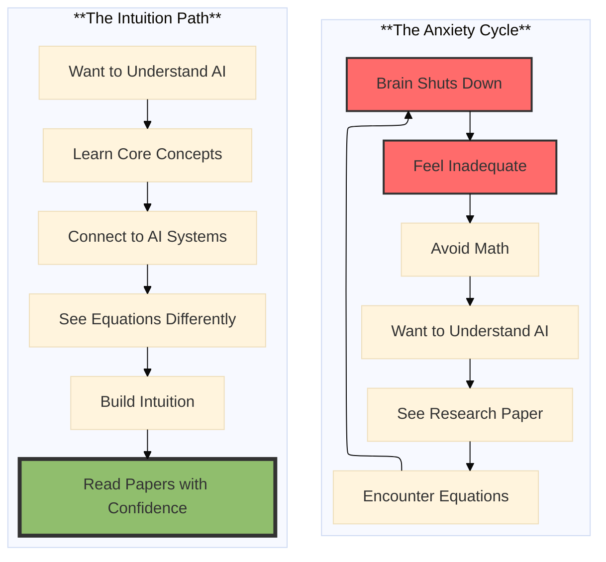

# If the words "linear algebra" make you nervous, yo

```mermaid
---
config:
  theme: base
  layout: elk
---
graph TD
    subgraph "**The Anxiety Cycle**"
        A[Want to Understand AI] --> B[See Research Paper]
        B --> C[Encounter Equations]
        C --> D[Brain Shuts Down]
        D --> E[Feel Inadequate]
        E --> F[Avoid Math]
        F --> A
    end
    
    subgraph "**The Intuition Path**"
        G[Want to Understand AI] --> H[Learn Core Concepts]
        H --> I[Connect to AI Systems]
        I --> J[See Equations Differently]
        J --> K[Build Intuition]
        K --> L[Read Papers with Confidence]
    end
    
    style D fill:#ff6b6b,stroke:#333,stroke-width:2px
    style E fill:#ff6b6b,stroke:#333,stroke-width:2px
    style L fill:#90be6d,stroke:#333,stroke-width:4px
```
