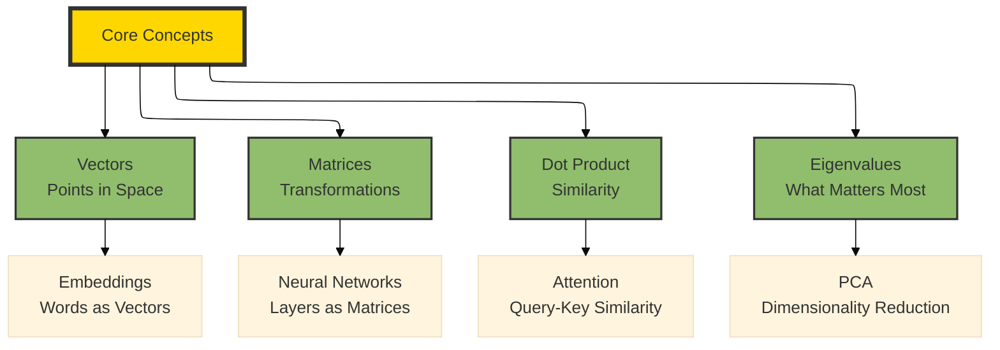

# Everything in AI linear algebra comes down to four

```mermaid
---
config:
  theme: base
  layout: elk
---
graph TD
    A[Core Concepts] --> B[Vectors<br/>Points in Space]
    A --> C[Matrices<br/>Transformations]
    A --> D[Dot Product<br/>Similarity]
    A --> E[Eigenvalues<br/>What Matters Most]
    
    B --> B1[Embeddings<br/>Words as Vectors]
    C --> C1[Neural Networks<br/>Layers as Matrices]
    D --> D1[Attention<br/>Query-Key Similarity]
    E --> E1[PCA<br/>Dimensionality Reduction]
    
    style A fill:#ffd700,stroke:#333,stroke-width:4px
    style B fill:#90be6d,stroke:#333,stroke-width:2px
    style C fill:#90be6d,stroke:#333,stroke-width:2px
    style D fill:#90be6d,stroke:#333,stroke-width:2px
    style E fill:#90be6d,stroke:#333,stroke-width:2px
```
