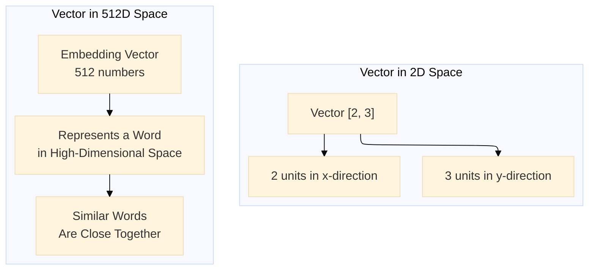

# A vector is just a list of numbers. But more impor

```mermaid
---
config:
  theme: base
  layout: elk
---
graph TD
    subgraph Vector2D["Vector in 2D Space"]
        V["Vector [2, 3]"]
        V --> X["2 units in x-direction"]
        V --> Y["3 units in y-direction"]
    end
    
    subgraph Vector512D["Vector in 512D Space"]
        E["Embedding Vector\n512 numbers"]
        E --> W["Represents a Word\nin High-Dimensional Space"]
        W --> S["Similar Words\nAre Close Together"]
    end
```
