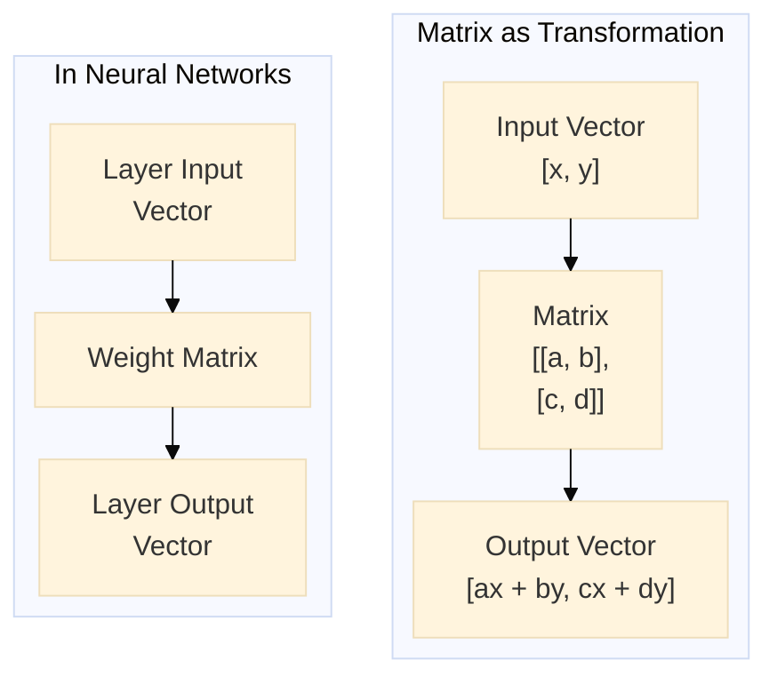

# A matrix is a grid of numbers. But more importantl

```mermaid
---
config:
  theme: base
  layout: elk
---
graph TD
    subgraph MatrixTransform["Matrix as Transformation"]
        I["Input Vector\n[x, y]"] --> M["Matrix\n[[a, b],\n[c, d]]"]
        M --> O["Output Vector\n[ax + by, cx + dy]"]
    end
    
    subgraph NeuralNetworks["In Neural Networks"]
        L["Layer Input\nVector"] --> W["Weight Matrix"]
        W --> A["Layer Output\nVector"]
    end
```
