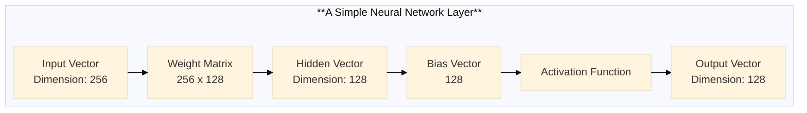

# Every layer in a neural network is a matrix multip

```mermaid
---
config:
  theme: base
  layout: elk
---
graph LR
    subgraph "**A Simple Neural Network Layer**"
        X[Input Vector<br/>Dimension: 256] --> W[Weight Matrix<br/>256 x 128]
        W --> H[Hidden Vector<br/>Dimension: 128]
        H --> B[Bias Vector<br/>128]
        B --> A[Activation Function]
        A --> O[Output Vector<br/>Dimension: 128]
    end
```
