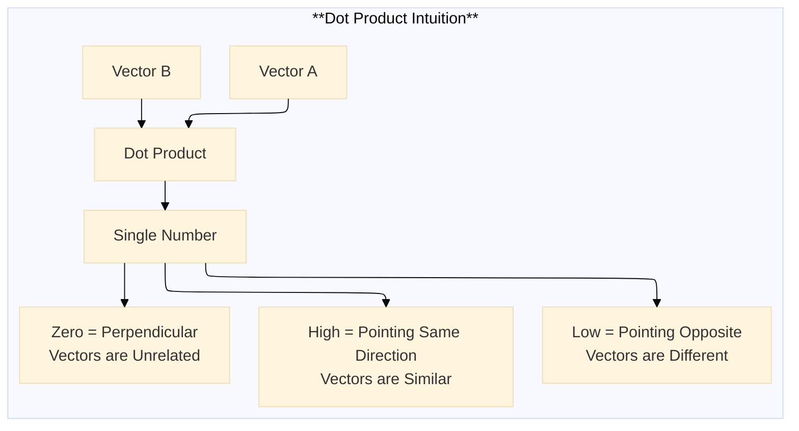

# The dot product takes two vectors and returns a si

```mermaid
---
config:
  theme: base
  layout: elk
---
graph TD
    subgraph "**Dot Product Intuition**"
        A[Vector A] --> D[Dot Product]
        B[Vector B] --> D
        D --> R[Single Number]
        
        R --> H[High = Pointing Same Direction<br/>Vectors are Similar]
        R --> L[Low = Pointing Opposite<br/>Vectors are Different]
        R --> Z[Zero = Perpendicular<br/>Vectors are Unrelated]
    end
```
