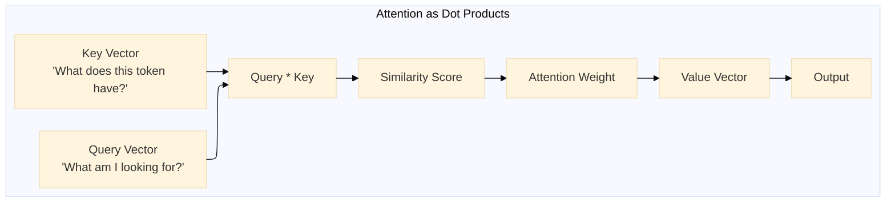

# The attention mechanism—the heart of Transformers—

```mermaid
---
config:
  theme: base
  layout: elk
---
graph LR
    subgraph AttentionDot["Attention as Dot Products"]
        Q["Query Vector\n'What am I looking for?'"] --> D["Query * Key"]
        K["Key Vector\n'What does this token have?'"] --> D
        D --> S["Similarity Score"]
        S --> A["Attention Weight"]
        A --> V["Value Vector"]
        V --> O["Output"]
    end
```
