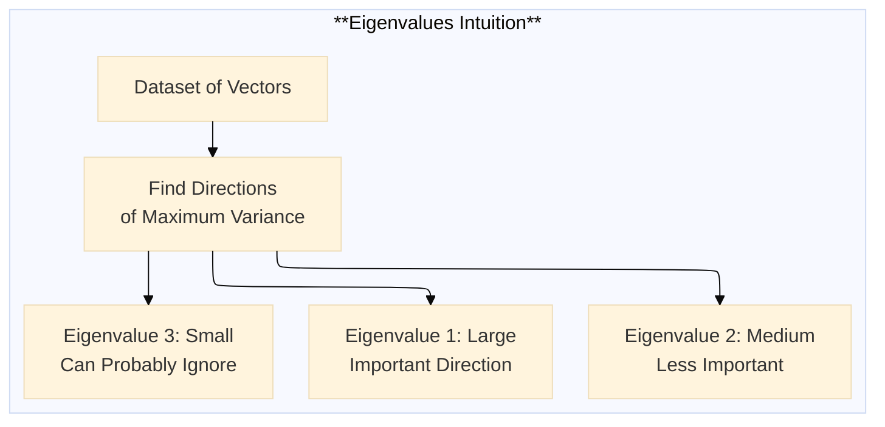

# Eigenvalues tell you what's **important** in your 

```mermaid
---
config:
  theme: base
  layout: elk
---
graph TD
    subgraph "**Eigenvalues Intuition**"
        D[Dataset of Vectors] --> P[Find Directions<br/>of Maximum Variance]
        P --> E1[Eigenvalue 1: Large<br/>Important Direction]
        P --> E2[Eigenvalue 2: Medium<br/>Less Important]
        P --> E3[Eigenvalue 3: Small<br/>Can Probably Ignore]
    end
```
