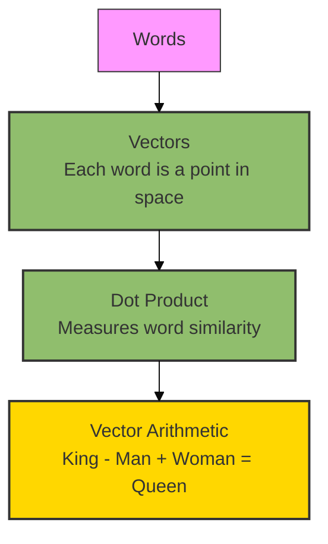

# ### Example 1: Word Embeddings (Word2Vec, GloVe)

```mermaid
---
config:
  theme: base
  layout: elk
---
graph TD
    A[Words] --> B[Vectors<br/>Each word is a point in space]
    B --> C[Dot Product<br/>Measures word similarity]
    C --> D[Vector Arithmetic<br/>King - Man + Woman = Queen]
    
    style A fill:#f9f,stroke:#333,stroke-width:1px
    style B fill:#90be6d,stroke:#333,stroke-width:2px
    style C fill:#90be6d,stroke:#333,stroke-width:2px
    style D fill:#ffd700,stroke:#333,stroke-width:2px
```
