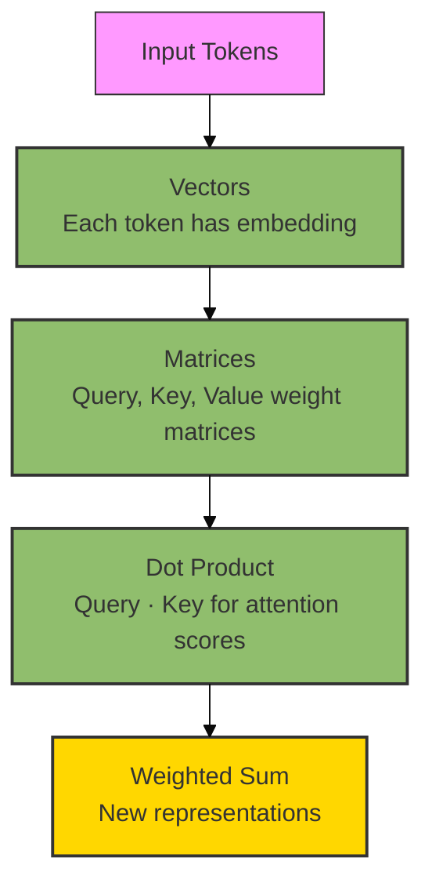

# ### Example 2: Transformer Attention

```mermaid
---
config:
  theme: base
  layout: elk
---
graph TD
    A[Input Tokens] --> B[Vectors<br/>Each token has embedding]
    B --> C[Matrices<br/>Query, Key, Value weight matrices]
    C --> D[Dot Product<br/>Query · Key for attention scores]
    D --> E[Weighted Sum<br/>New representations]
    
    style A fill:#f9f,stroke:#333,stroke-width:1px
    style B fill:#90be6d,stroke:#333,stroke-width:2px
    style C fill:#90be6d,stroke:#333,stroke-width:2px
    style D fill:#90be6d,stroke:#333,stroke-width:2px
    style E fill:#ffd700,stroke:#333,stroke-width:2px
```
