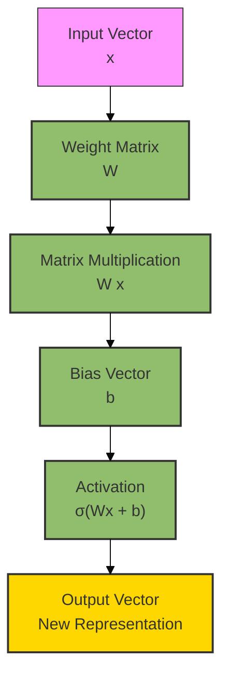

# ### Example 3: Neural Network Layer

```mermaid
---
config:
  theme: base
  layout: elk
---
graph TD
    A["Input Vector\nx"] --> B["Weight Matrix\nW"]
    B --> C["Matrix Multiplication\nW x"]
    C --> D["Bias Vector\nb"]
    D --> E["Activation\nσ(Wx + b)"]
    E --> F["Output Vector\nNew Representation"]
    
    style A fill:#f9f,stroke:#333,stroke-width:1px
    style B fill:#90be6d,stroke:#333,stroke-width:2px
    style C fill:#90be6d,stroke:#333,stroke-width:2px
    style D fill:#90be6d,stroke:#333,stroke-width:2px
    style E fill:#90be6d,stroke:#333,stroke-width:2px
    style F fill:#ffd700,stroke:#333,stroke-width:2px

```
