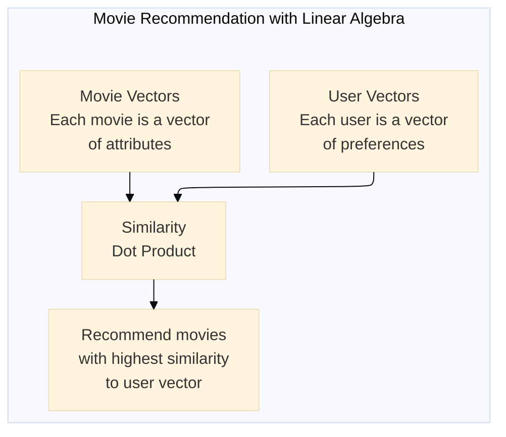

# Let's apply these concepts to build intuition for 

```mermaid
---
config:
  theme: base
  layout: elk
---
graph TD
    subgraph "Movie Recommendation with Linear Algebra"
        U[User Vectors<br/>Each user is a vector<br/>of preferences] --> S[Similarity<br/>Dot Product]
        M[Movie Vectors<br/>Each movie is a vector<br/>of attributes] --> S
        S --> R[Recommend movies<br/>with highest similarity<br/>to user vector]
    end
```
