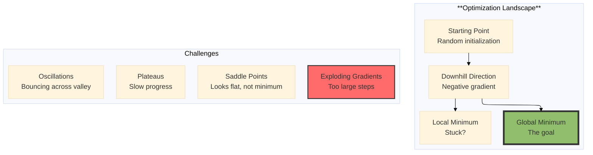

# Think of optimization as navigating a landscape. Y

```mermaid
---
config:
  theme: base
  layout: elk
---
graph TD
    subgraph "**Optimization Landscape**"
        S[Starting Point<br/>Random initialization] --> D[Downhill Direction<br/>Negative gradient]
        D --> L1[Local Minimum<br/>Stuck?]
        D --> G[Global Minimum<br/>The goal]
    end
    
    subgraph "Challenges"
        P[Plateaus<br/>Slow progress]
        S2[Saddle Points<br/>Looks flat, not minimum]
        O[Oscillations<br/>Bouncing across valley]
        E[Exploding Gradients<br/>Too large steps]
    end
    
    style G fill:#90be6d,stroke:#333,stroke-width:4px
    style E fill:#ff6b6b,stroke:#333,stroke-width:2px
```
