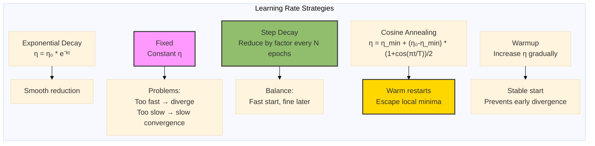

# The learning rate is the most important hyperparam

```mermaid
---
config:
  theme: base
  layout: elk
---
graph TD
    subgraph LearningRate["Learning Rate Strategies"]
        F["Fixed\nConstant η"] --> P["Problems:\nToo fast → diverge\nToo slow → slow convergence"]
        
        S["Step Decay\nReduce by factor every N epochs"] --> B["Balance:\nFast start, fine later"]
        
        E["Exponential Decay\nη = η₀ * e⁻ᵏᵗ"] --> S2["Smooth reduction"]
        
        C["Cosine Annealing\nη = η_min + (η₀-η_min) * (1+cos(πt/T))/2"] --> W1["Warm restarts\nEscape local minima"]
        
        W2["Warmup\nIncrease η gradually"] --> U["Stable start\nPrevents early divergence"]
    end
    
    style F fill:#f9f,stroke:#333,stroke-width:2px
    style S fill:#90be6d,stroke:#333,stroke-width:2px
    style W1 fill:#ffd700,stroke:#333,stroke-width:2px
```
