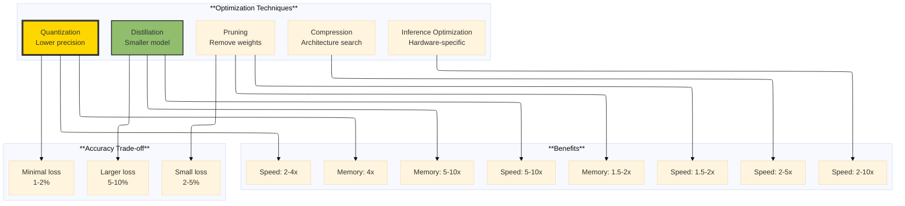

# Model optimization is a spectrum of techniques, ea

```mermaid
---
config:
  theme: base
  layout: elk
---
graph TD
    subgraph "**Optimization Techniques**"
        Q[Quantization<br/>Lower precision]
        P[Pruning<br/>Remove weights]
        D[Distillation<br/>Smaller model]
        C[Compression<br/>Architecture search]
        O[Inference Optimization<br/>Hardware-specific]
    end
    
    subgraph "**Benefits**"
        Q --> S[Speed: 2-4x]
        Q --> M[Memory: 4x]
        
        P --> S2[Speed: 1.5-2x]
        P --> M2[Memory: 1.5-2x]
        
        D --> S3[Speed: 5-10x]
        D --> M3[Memory: 5-10x]
        
        C --> S4[Speed: 2-5x]
        
        O --> S5[Speed: 2-10x]
    end
    
    subgraph "**Accuracy Trade-off**"
        Q --> A[Minimal loss<br/>1-2%]
        P --> A2[Small loss<br/>2-5%]
        D --> A3[Larger loss<br/>5-10%]
    end
    
    style Q fill:#ffd700,stroke:#333,stroke-width:4px
    style D fill:#90be6d,stroke:#333,stroke-width:2px
```
