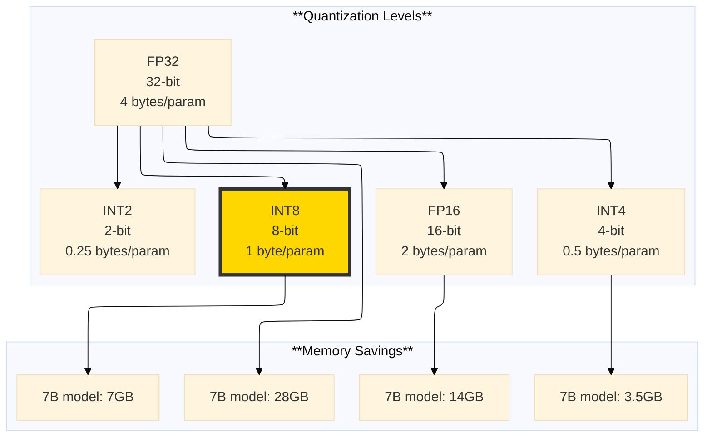

# Quantization reduces the number of bits used to re

```mermaid
---
config:
  theme: base
  layout: elk
---
graph TD
    subgraph "**Quantization Levels**"
        FP32[FP32<br/>32-bit<br/>4 bytes/param] --> FP16[FP16<br/>16-bit<br/>2 bytes/param]
        FP32 --> INT8[INT8<br/>8-bit<br/>1 byte/param]
        FP32 --> INT4[INT4<br/>4-bit<br/>0.5 bytes/param]
        FP32 --> INT2[INT2<br/>2-bit<br/>0.25 bytes/param]
    end
    
    subgraph "**Memory Savings**"
        FP32 --> M1[7B model: 28GB]
        FP16 --> M2[7B model: 14GB]
        INT8 --> M3[7B model: 7GB]
        INT4 --> M4[7B model: 3.5GB]
    end
    
    style INT8 fill:#ffd700,stroke:#333,stroke-width:4px
```
