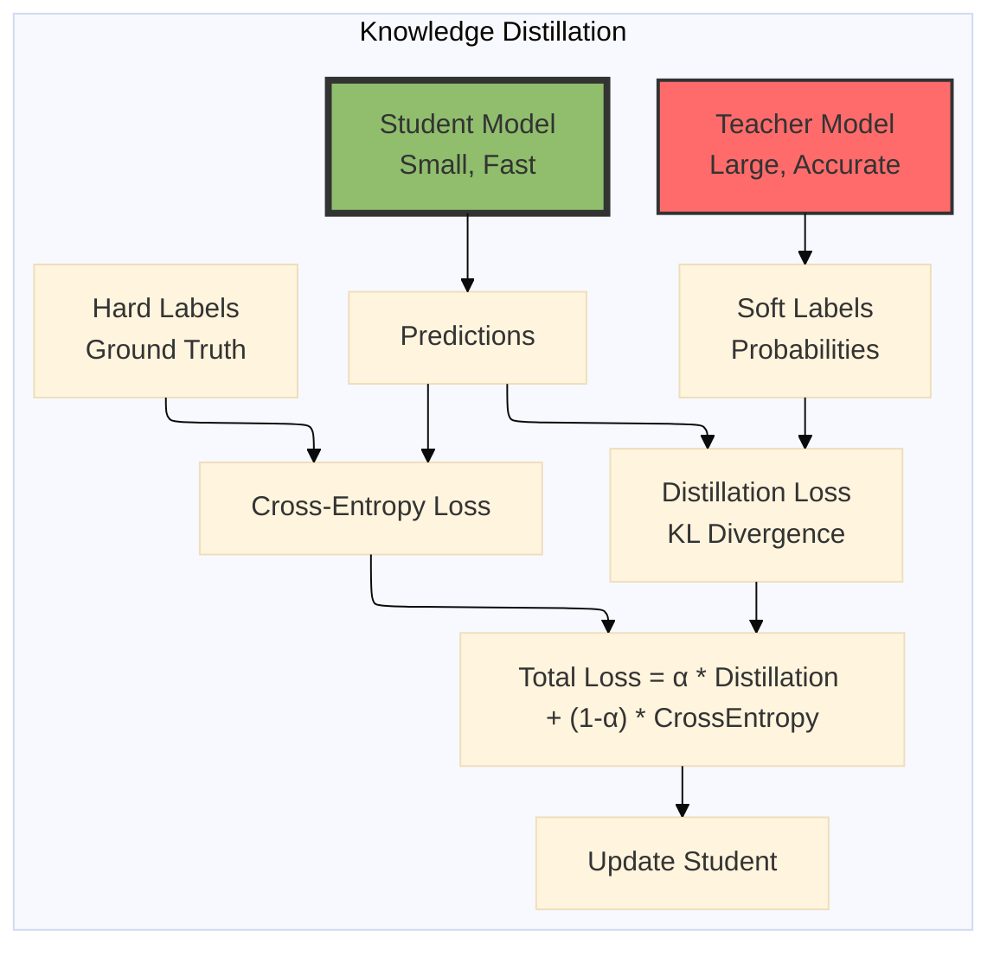

# Knowledge distillation trains a small "student" mo

```mermaid
---
config:
  theme: base
  layout: elk
---
graph TD
    subgraph KnowledgeDistillation["Knowledge Distillation"]
        T["Teacher Model\nLarge, Accurate"] --> L["Soft Labels\nProbabilities"]
        
        S["Student Model\nSmall, Fast"] --> P["Predictions"]
        
        L --> D["Distillation Loss\nKL Divergence"]
        P --> D
        
        Y["Hard Labels\nGround Truth"] --> C["Cross-Entropy Loss"]
        P --> C
        
        D --> Total["Total Loss = α * Distillation + (1-α) * CrossEntropy"]
        C --> Total
        
        Total --> U["Update Student"]
    end
    
    style T fill:#ff6b6b,stroke:#333,stroke-width:2px
    style S fill:#90be6d,stroke:#333,stroke-width:4px
```
