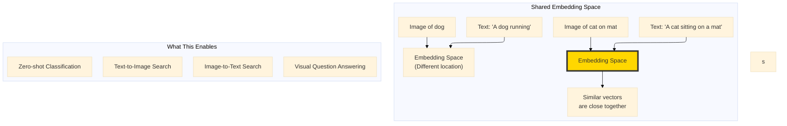

# Multimodal models learn to map different modalitie

```mermaid
---
config:
  theme: base
  layout: elk
---
graph TD
    subgraph SharedSpace["Shared Embedding Space"]
        T["Text: 'A cat sitting on a mat'"] --> E["Embedding Space"]
        I["Image of cat on mat"] --> E
        
        E --> S["Similar vectors\nare close together"]
        
        T2["Text: 'A dog running'"] --> E2["Embedding Space\n(Different location)"]
        I2["Image of dog"] --> E2
    end
    
    subgraph Enabled["What This Enables"]
        A["Text-to-Image Search"]
        B["Image-to-Text Search"]
        C["Zero-shot Classification"]
        D["Visual Question Answering"]
    end
    
    style E fill:#ffd700,stroke:#333,stroke-width:4px
    s
```
