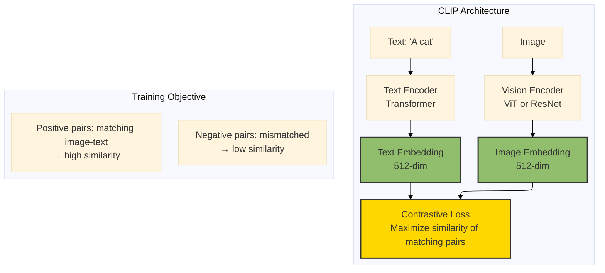

# CLIP (Contrastive Language-Image Pre-training) lea

```mermaid
---
config:
  theme: base
  layout: elk
---
graph TD
    subgraph CLIPArch["CLIP Architecture"]
        I["Image"] --> V["Vision Encoder\nViT or ResNet"]
        V --> VI["Image Embedding\n512-dim"]
        
        T["Text: 'A cat'"] --> L["Text Encoder\nTransformer"]
        L --> TI["Text Embedding\n512-dim"]
        
        VI --> C["Contrastive Loss\nMaximize similarity of matching pairs"]
        TI --> C
    end
    
    subgraph TrainingObj["Training Objective"]
        P["Positive pairs: matching image-text\n→ high similarity"]
        N["Negative pairs: mismatched\n→ low similarity"]
    end
    
    style VI fill:#90be6d,stroke:#333,stroke-width:2px
    style TI fill:#90be6d,stroke:#333,stroke-width:2px
    style C fill:#ffd700,stroke:#333,stroke-width:2px
    
```
