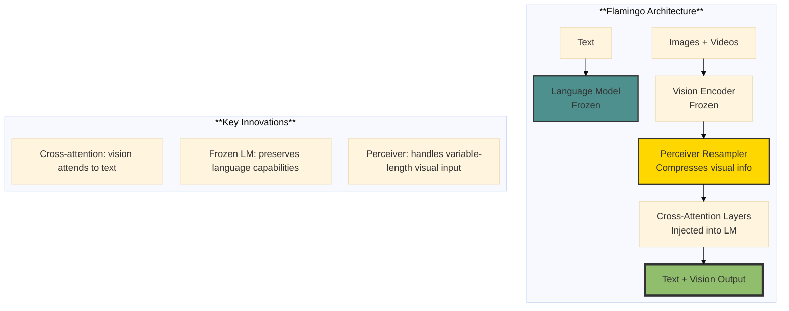

# Flamingo (DeepMind, 2022) showed how to add vision

```mermaid
---
config:
  theme: base
  layout: elk
---
graph TD
    subgraph "**Flamingo Architecture**"
        I[Images + Videos] --> V[Vision Encoder<br/>Frozen]
        V --> P[Perceiver Resampler<br/>Compresses visual info]
        
        T[Text] --> L[Language Model<br/>Frozen]
        P --> A[Cross-Attention Layers<br/>Injected into LM]
        A --> O[Text + Vision Output]
    end
    
    subgraph "**Key Innovations**"
        K1[Frozen LM: preserves language capabilities]
        K2[Perceiver: handles variable-length visual input]
        K3[Cross-attention: vision attends to text]
    end
    
    style L fill:#4d908e,stroke:#333,stroke-width:2px
    style P fill:#ffd700,stroke:#333,stroke-width:2px
    style O fill:#90be6d,stroke:#333,stroke-width:4px
```
