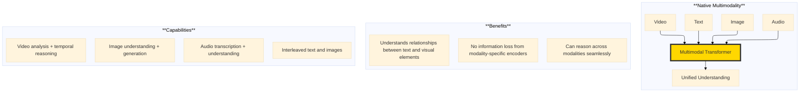

# Unlike models that combine separate encoders, Gemi

```mermaid
---
config:
  theme: base
  layout: elk
---
graph TD
    subgraph "**Native Multimodality**"
        T[Text] --> M[Multimodal Transformer]
        I[Image] --> M
        A[Audio] --> M
        V[Video] --> M
        
        M --> O[Unified Understanding]
    end
    
    subgraph "**Benefits**"
        B1[No information loss from modality-specific encoders]
        B2[Can reason across modalities seamlessly]
        B3[Understands relationships between text and visual elements]
    end
    
    subgraph "**Capabilities**"
        C1[Image understanding + generation]
        C2[Audio transcription + understanding]
        C3[Video analysis + temporal reasoning]
        C4[Interleaved text and images]
    end
    
    style M fill:#ffd700,stroke:#333,stroke-width:4px
```
