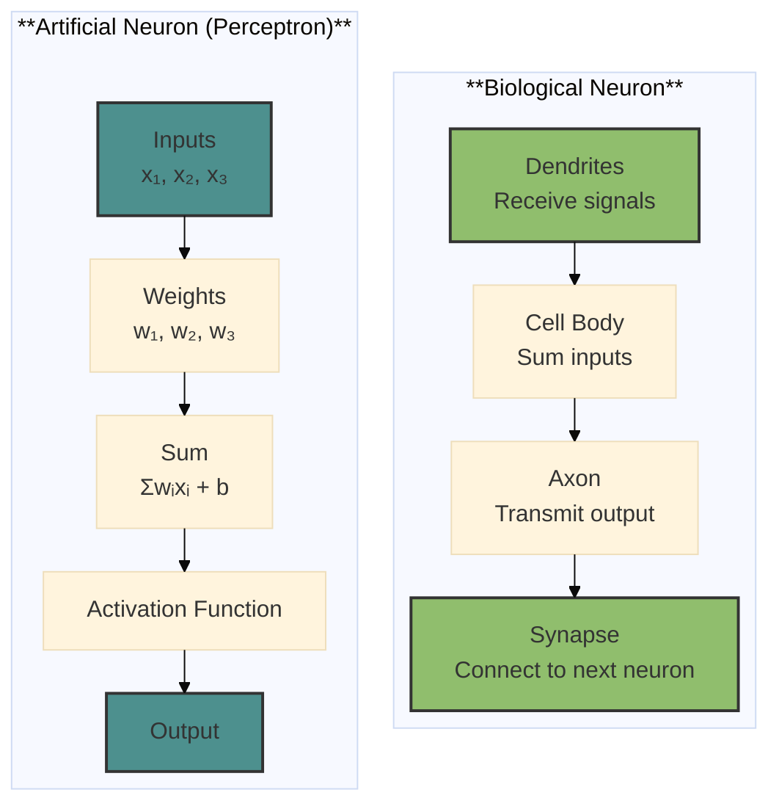

# Before artificial neurons, there were real ones. U

```mermaid
---
config:
  theme: base
  layout: elk
---

graph TD
    subgraph "**Biological Neuron**"
        D[Dendrites<br/>Receive signals] --> C[Cell Body<br/>Sum inputs]
        C --> A[Axon<br/>Transmit output]
        A --> S[Synapse<br/>Connect to next neuron]
    end
    
    subgraph "**Artificial Neuron (Perceptron)**"
        X[Inputs<br/>x₁, x₂, x₃] --> W[Weights<br/>w₁, w₂, w₃]
        W --> S2[Sum<br/>Σwᵢxᵢ + b]
        S2 --> F[Activation Function]
        F --> O[Output]
    end
    
    style D fill:#90be6d,stroke:#333,stroke-width:2px
    style S fill:#90be6d,stroke:#333,stroke-width:2px
    style X fill:#4d908e,stroke:#333,stroke-width:2px
    style O fill:#4d908e,stroke:#333,stroke-width:2px
```
