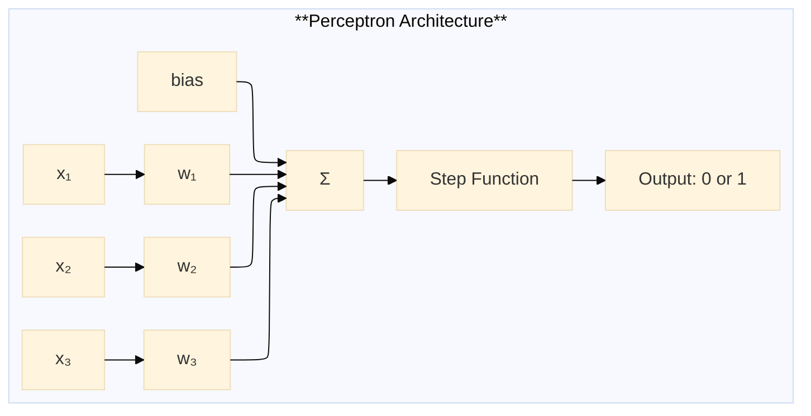

# The perceptron, invented in 1958 by Frank Rosenbla

```mermaid
---
config:
  theme: base
  layout: elk
---
graph LR
    subgraph "**Perceptron Architecture**"
        X1[x₁] --> W1[w₁]
        X2[x₂] --> W2[w₂]
        X3[x₃] --> W3[w₃]
        W1 --> S[Σ]
        W2 --> S
        W3 --> S
        B[bias] --> S
        S --> A[Step Function]
        A --> Y[Output: 0 or 1]
    end
```
