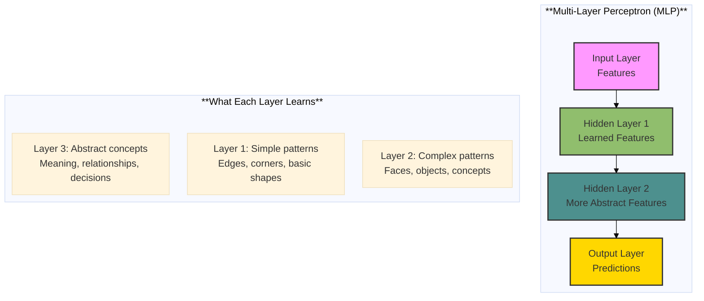

# The solution to the perceptron's limitation was si

```mermaid
---
config:
  theme: base
  layout: elk
---
graph TD
    subgraph "**Multi-Layer Perceptron (MLP)**"
        I[Input Layer<br/>Features] --> H1[Hidden Layer 1<br/>Learned Features]
        H1 --> H2[Hidden Layer 2<br/>More Abstract Features]
        H2 --> O[Output Layer<br/>Predictions]
    end
    
    subgraph "**What Each Layer Learns**"
        L1[Layer 1: Simple patterns<br/>Edges, corners, basic shapes]
        L2[Layer 2: Complex patterns<br/>Faces, objects, concepts]
        L3[Layer 3: Abstract concepts<br/>Meaning, relationships, decisions]
    end
    
    style I fill:#f9f,stroke:#333,stroke-width:2px
    style H1 fill:#90be6d,stroke:#333,stroke-width:2px
    style H2 fill:#4d908e,stroke:#333,stroke-width:2px
    style O fill:#ffd700,stroke:#333,stroke-width:2px
```
