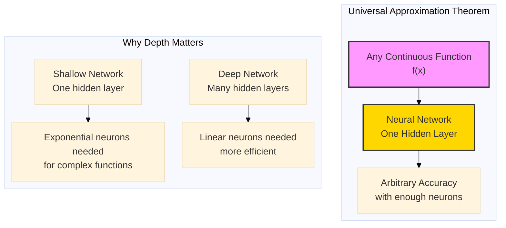

# The Universal Approximation Theorem states: **A fe

```mermaid
---
config:
  theme: base
  layout: elk
---
graph TD
    subgraph UAT["Universal Approximation Theorem"]
        F["Any Continuous Function\nf(x)"] --> N["Neural Network\nOne Hidden Layer"]
        N --> A["Arbitrary Accuracy\nwith enough neurons"]
    end
    
    subgraph WhyDepth["Why Depth Matters"]
        S["Shallow Network\nOne hidden layer"] --> E["Exponential neurons needed\nfor complex functions"]
        D["Deep Network\nMany hidden layers"] --> E2["Linear neurons needed\nmore efficient"]
    end
    
    style F fill:#f9f,stroke:#333,stroke-width:2px
    style N fill:#ffd700,stroke:#333,stroke-width:2px
    
```
