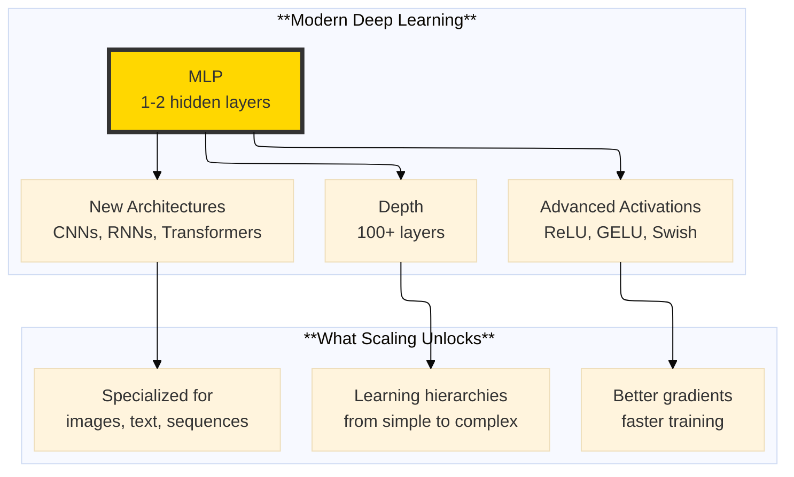

# The MLP you just built is the foundation. Modern d

```mermaid
---
config:
  theme: base
  layout: elk
---
graph TD
    subgraph "**Modern Deep Learning**"
        MLP[MLP<br/>1-2 hidden layers] --> D[Depth<br/>100+ layers]
        MLP --> A[Advanced Activations<br/>ReLU, GELU, Swish]
        MLP --> N[New Architectures<br/>CNNs, RNNs, Transformers]
    end
    
    subgraph "**What Scaling Unlocks**"
        D --> C1[Learning hierarchies<br/>from simple to complex]
        A --> C2[Better gradients<br/>faster training]
        N --> C3[Specialized for<br/>images, text, sequences]
    end
    
    style MLP fill:#ffd700,stroke:#333,stroke-width:4px
```
