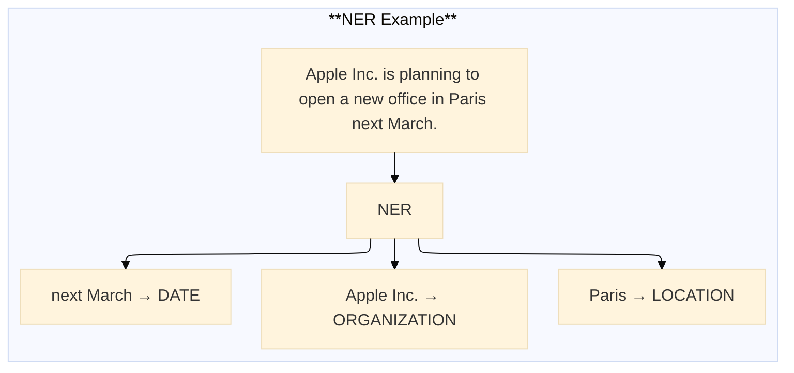

# NER identifies and classifies named entities in te

```mermaid
---
config:
  theme: base
  layout: elk
---
graph TD
    subgraph "**NER Example**"
        T[Apple Inc. is planning to open a new office in Paris next March.] --> NER
        
        NER --> E1[Apple Inc. → ORGANIZATION]
        NER --> E2[Paris → LOCATION]
        NER --> E3[next March → DATE]
    end
```
