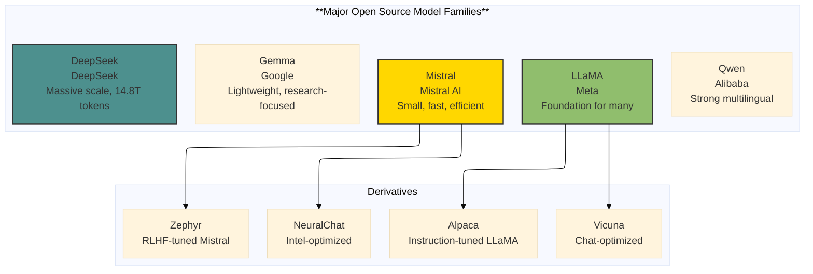

# The open source ecosystem has exploded. Here are t

```mermaid
---
config:
  theme: base
  layout: elk
---

graph TD
    subgraph "**Major Open Source Model Families**"
        L[LLaMA<br/>Meta<br/>Foundation for many]
        M[Mistral<br/>Mistral AI<br/>Small, fast, efficient]
        D[DeepSeek<br/>DeepSeek<br/>Massive scale, 14.8T tokens]
        Q[Qwen<br/>Alibaba<br/>Strong multilingual]
        G[Gemma<br/>Google<br/>Lightweight, research-focused]
    end
    
    subgraph "Derivatives"
        L --> A[Alpaca<br/>Instruction-tuned LLaMA]
        L --> V[Vicuna<br/>Chat-optimized]
        M --> Z[Zephyr<br/>RLHF-tuned Mistral]
        M --> N[NeuralChat<br/>Intel-optimized]
    end
    
    style L fill:#90be6d,stroke:#333,stroke-width:2px
    style M fill:#ffd700,stroke:#333,stroke-width:2px
    style D fill:#4d908e,stroke:#333,stroke-width:2px
```
