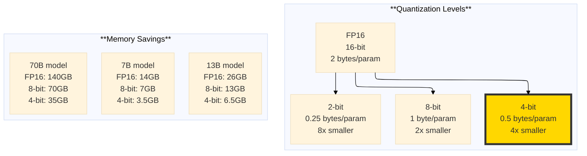

# Quantization reduces model size by using fewer bit

```mermaid
---
config:
  theme: base
  layout: elk
---

graph TD
    subgraph "**Quantization Levels**"
        FP16[FP16<br/>16-bit<br/>2 bytes/param] --> Q8[8-bit<br/>1 byte/param<br/>2x smaller]
        FP16 --> Q4[4-bit<br/>0.5 bytes/param<br/>4x smaller]
        FP16 --> Q2[2-bit<br/>0.25 bytes/param<br/>8x smaller]
    end
    
    subgraph "**Memory Savings**"
        S7[7B model<br/>FP16: 14GB<br/>8-bit: 7GB<br/>4-bit: 3.5GB]
        S13[13B model<br/>FP16: 26GB<br/>8-bit: 13GB<br/>4-bit: 6.5GB]
        S70[70B model<br/>FP16: 140GB<br/>8-bit: 70GB<br/>4-bit: 35GB]
    end
    
    style Q4 fill:#ffd700,stroke:#333,stroke-width:4px
```
