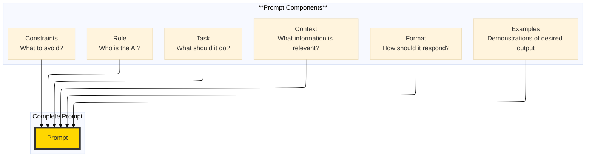

# A prompt is more than just a question. It's a stru

```mermaid
---
config:
  theme: base
  layout: elk
---
graph TD
    subgraph "**Prompt Components**"
        R[Role<br/>Who is the AI?]
        T[Task<br/>What should it do?]
        C[Context<br/>What information is relevant?]
        F[Format<br/>How should it respond?]
        E[Examples<br/>Demonstrations of desired output]
        X[Constraints<br/>What to avoid?]
    end
    
    subgraph "Complete Prompt"
        R --> P[Prompt]
        T --> P
        C --> P
        F --> P
        E --> P
        X --> P
    end
    
    style P fill:#ffd700,stroke:#333,stroke-width:4px
```
