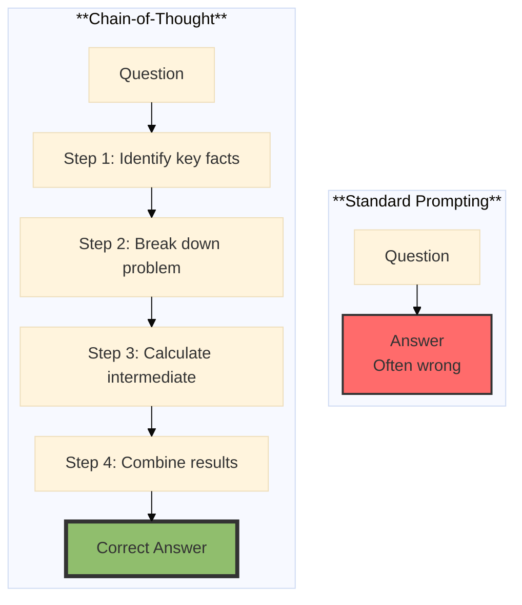

# Chain-of-Thought (CoT) prompts the model to show i

```mermaid
---
config:
  theme: base
  layout: elk
---
graph TD
    subgraph "**Standard Prompting**"
        Q[Question] --> A[Answer<br/>Often wrong]
    end
    
    subgraph "**Chain-of-Thought**"
        Q2[Question] --> S[Step 1: Identify key facts]
        S --> T[Step 2: Break down problem]
        T --> U[Step 3: Calculate intermediate]
        U --> V[Step 4: Combine results]
        V --> A2[Correct Answer]
    end
    
    style A fill:#ff6b6b,stroke:#333,stroke-width:2px
    style A2 fill:#90be6d,stroke:#333,stroke-width:4px
```
