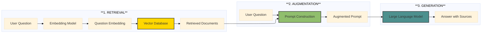

# RAG combines three components into a powerful pipe

```mermaid
---
config:
  theme: base
  layout: elk
---
flowchart LR
 subgraph subGraph0["**1. RETRIEVAL**"]
        E1["Embedding Model"]
        Q["User Question"]
        QE["Question Embedding"]
        VS["Vector Database"]
        R["Retrieved Documents"]
  end
 subgraph subGraph1["**2. AUGMENTATION**"]
        P["Prompt Construction"]
        Q2["User Question"]
        A["Augmented Prompt"]
  end
 subgraph subGraph2["**3. GENERATION**"]
        LLM["Large Language Model"]
        O["Answer with Sources"]
  end
    Q --> E1
    E1 --> QE
    QE --> VS
    VS --> R
    Q2 --> P
    R --> P
    P --> A
    A --> LLM
    LLM --> O

    style VS fill:#ffd700,stroke:#333,stroke-width:2px
    style P fill:#90be6d,stroke:#333,stroke-width:2px
    style LLM fill:#4d908e,stroke:#333,stroke-width:2px

```
